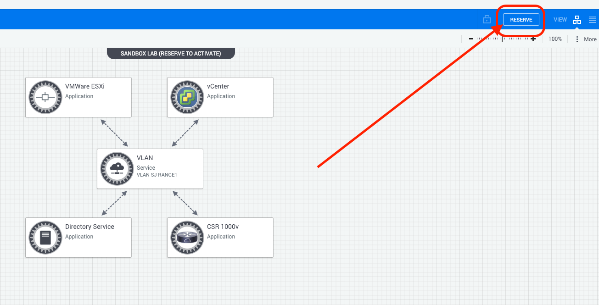
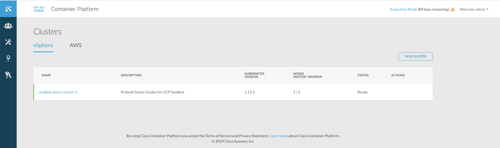

# Cisco Container Platform 101

## Objectives

This Learning Lab introduces you to the Cisco Container Platform product, its interface, APIs, and product benefits.
The lab uses Cisco Container Platform APIs to create, provision and manage a Kubernetes cluster on the infrastructure you see in front of you.

We then use your new Kubernetes cluster to deploy a containerised application onto Kubernetes, with storage persistence.

# Audience

  * DevOps and SRE engineering teams.
  * IT Audiences looking to consume containers.
  * IT Audiences needing on-premise or multi-cloud Container APIs.
  * IT Audience preparing to address their developers need for Docker and Containers.

# What is Cisco Container Platform?
Cisco Container Platform is a NEW product, aimed at making the delivery of an on-premise or multi-cloud container platform as simple as the public cloud user experience.

Specifically;

  - IT teams should not need to specialise in Kubernetes internals to provide Kubernetes services to their development teams.
  - Creation and Maintenance of Kubernetes clusters should be automated and API driven.
  - The end result should be native kubernetes access for the end developers, not custom tooling.
  - The solution should provide validated, previously tested clusters and configurations, with regular releases and updates.

  

With Cisco Container Platform, your IT teams can tie self-service provisioning of multiple Kubernetes clusters into their existing management tooling; or use the Container Platform UI to create a "**Kubernetes as a Service**" layer for your Organization, while benefiting from the known-cost and data sovereignty aspects of on-premise workloads.

Also, because Cisco Container Platform produces "Vanilla" Kubernetes clusters, your DevOps teams can write truly cross-environment automation utilising the Kubernetes API, making the consumption of multiple public and private environments a much less daunting task.

  

# What is HyperFlex?

As with any "Cloud" provider, APIs are the key to solid automation, making self service for multiple users possible.

Cisco HyperFlex brings this concept on-premise, with a single SKU that clusters to provide scale-out compute, storage and networking in a single product.

HyperFlex servers, powered by Cisco UCS Management give a production-tested base on which to build an on-premises **Kubernetes as a Service** solution, with all the APIs needed to allow Cisco Container Platform to manage the creation and updates of your tenant Kubernetes clusters.

HyperFlex storage is also resilient across the servers in the HyperFlex pool, allowing Cisco Container Platform to use this for Kubernetes persistent volumes.

[HyperFlex](https://www.cisco.com/c/en/us/products/hyperconverged-infrastructure/index.html) is a topic all of its own; but knowing that Cisco Container Platform deploys on top of it is all you need here. Existing HyperFlex users can install Cisco Container Platform directly onto their existing installation, it just consumes the HyperFlex APIs!

  

Let's dig in!

# Step 0 - Access the Cisco Container Platform sandbox!

First, we need a Cisco Container Platform environment, luckily we have plenty of these in the DevNet sandbox, allowing you to reserve access to a CCP environment for up to 7 days, plenty of time for this lab!

### Step 1 - Reserve a Cisco Container Platform sandbox.
For this we will use the "Cisco Container Platform DEVNET Sandbox", this environment will provide access to a pre-installed Cisco Container Platform cluster, serving as our "On premise" setup for this Lab.

Go to [https://devnetsandbox.cisco.com](https://devnetsandbox.cisco.com/RM/Diagram/Index/f8dbda33-0c6e-4c4d-9fea-73e4451d730c?diagramType=Topology), login and reserve the "Cisco Container Platform" sandbox for 2 hours.

  

Click `RESERVE`

  

Click `RESERVE` once more.

### Step 2 - Access Cisco Container Platform.
The Sandbox environment will take about 10 minutes to spin up, it creates a fresh installation of CCP for each user and will E-Mail you VPN credentials when ready. Using the VPN lets us remotely access this new on-premise environment.

The E-Mail also contains instructions for installing the AnyConnect VPN client if you do not already have it; however the classroom workstations already have this installed.

Use the credentials and VPN URL to access the Cisco Container Platform Sandbox.

  

  

# 1. A Kubernetes Cluster provisioned by Cisco Cloud Platform.

We said Cisco Cloud Platform provides the API's to enable on-premise Kubernetes as a Service; This is where we prove it and get you hands on!

But first, lets take our first look at Cisco container platform through the UI, in your browser, just navigate to the following link:
[https://10.10.20.30:32238](https://10.10.20.30:32238)

As this is a throwaway lab environment, you will need to accept the HTTPS certificate warning in your browser.

## A. Log into Cisco Cloud Platform to view our clusters.

You will be greeted by the login screen, credentials for this lab are `admin` / `Cisco123`

  

Logging in will present you with the "Clusters" screen. Here we can see all the Kubernetes clusters that Cisco Container Platform has previously created for us.

## B. View your available Clusters.

In a new lab environment, you will have a single cluster pre-created `Sandbox-Demo-Cluster-1`. You can click on this cluster to see details of the nodes, IP addresses and links to access the dashboard and download the `kubeconfig` file for authentication.

  

## C. Cisco Container Platform permissions.

There are two types of access currently implemented in Cisco Container Platform, admin's that can create and view all clusters, and "DevOps" users that can only see the clusters they have been assigned; your sandbox has provided you an 'admin' user, so you are able to create clusters.

A "DevOps" style user called "User1234" could be configured to only see a specific cluster or subset of clusters, as in the screenshots below showing an admin and a devops user viewing the same Cisco Container Platform UI;

DevOps user 1234 logged in:
  

Admin user logged in will see all clusters:
  

## D. See the underlying infrastructure.

Cisco Container Platform and Hyperflex currently uses VMWare vCenter for it's virtual machine management, you can log into the vCenter for this environment with a to see the Cisco Container Platform virtual machines and observe provisioning actions as we follow this lab.

Open [THIS LINK (https://10.10.20.12/ui/)](https://10.10.20.12/ui/) in a new tab to see the vSphere UI, and log on with the following details:

  - Username: administrator@vsphere.local
  - Password: Cisco123!

You will be able to see Virtual Machines named after our current cluster in right hand column, along with the Cisco Container Platform management  themselves, which form a "control Kubernetes cluster" hosting the UI, API, automation and management as well as utilities for future upgrades.

  

At the bottom of the page, you will also be able to see recent events which Cisco Container Platform is orchestrating, in the example screenshot below we see a cluster named "1222test" was deleted.

  

# Next Steps!
Next, lets have a quick look over some of the other features and configuration options of Cisco Container Platform. Click the right arrow to continue!
