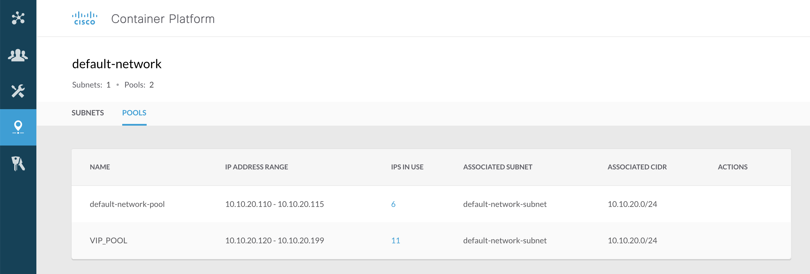
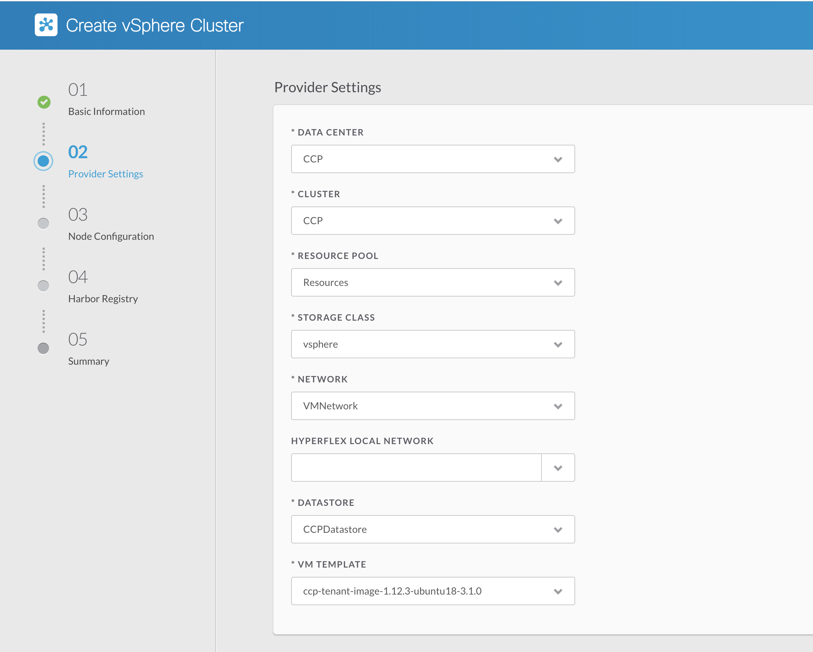

# Step 2: Provider Settings and VIP Pools

Clicking around the Cisco Cloud Platform UI, you'll notice a menu to the left.
Here, an admin can configure users and groups, including Active Directory login authentication, allowing access to clusters based on the users AD group. You can also define VIP pools under `Networks` > `Default Network`.

VIP pools allow an administrator to define a "real world" range of IP addresses that clusters can use to integrate with the existing IT or Enterprise environment, each cluster can be created with a specific VIP pool, and Cisco Container Platform will manage allocations of addresses from that pool to each Kubernetes cluster when a developer requests an "external" IP, such as creating `LoadBalancer` service or `Ingress` style Kubernetes objects.

Notice in the Cluster details page, a VIP has already been assigned to the Master node of your cluster, allowing access to the Kubernetes dashboard in your sandbox. The POD IP addresses used within the cluster are all internal and do not interact with any external networks; these have been configured on 192.168.0.0/16 for your cluster.

  

# 3. Cisco Container Platform APIs
Each Cisco Container platform installation comes with integrated Open API documentation, powered by Swagger.
You can access this [HERE (https://10.10.20.110/2/swaggerapi/)](https://10.10.20.110/2/swaggerapi/), where you will see all the currently supported platform APIs.

Click on `List Operations` to see titles, then `Expand Operations` to expand the subsections ready to use the API's in the next section; in this Lab, we're going to use the `/2/system` and `/2/clusters` sections, so expand those;

  

## Authenticate to the API
The Swagger UI will remember our authentication token once we use the `/2/system/login` API call, so that all other API's on the page will work.

Use your Cisco Container Platform credentials `User: admin`, `Password: Cisco123`, expand the `/2/system/login` box and enter the username and password, then click `Try it Out!`.

You should see a response code of 200, if not, check your credentials and try again.

  

## Query your clusters
We can use the API to query Cisco Container Platform for available clusters. Remember that only Clusters you have permission to see will be returned.

Expand the blue "GET" API labelled `/2/clusters` and hit `Try it out!`. Because we are querying for all clusters this API call needs no parameters.

  

The information we get back is used by the Cisco Cloud Platform UI to show information about our cluster, such as the number of workers and master nodes, as well as the state of the cluster.

We also are given the Cluster's UUID, this can be used for performing API actions against a specific cluster.

## Create a new Kubernetes Cluster with CCP
Okay, let's create two Kubernetes Clusters.

Firstly, from the UI, on the clusters tab, click "New Cluster".

  

You will be prompted to answer questions about your new cluster, from number of worker nodes, to where in the HyperFlex VM infrastructure it should be placed.

For our sandbox, there are only one set of options for most, selection boxes. Fill in as follows...

  

Click `NEXT`, Fill out page 2 as follows:



Click `NEXT`

New cluster page 3, Ensure on the 'Node Configuration' screen you have set `Worker Nodes` to `1`. The sandbox environment has limited resources to enable quality of service for other sandbox users and we want the cluster creation to succeed!


Set the `VM Username` to `ccpuser`

For SSH Public Key, you can use your own SSH pubic key or paste in the key below:

```
ecdsa-sha2-nistp521 AAAAE2VjZHNhLXNoYTItbmlzdHA1MjEAAAAIbmlzdHA1MjEAAACFBAHlSb9ZkXQL5/GI12258c+AIKVhDN1p1VYjvJR5oliqoR/gN/65D04BfsZWE8nk00AtJzvEVbjenwLeWuvIQsFs5AHa5uM4Fpmw3Ylpt1tB/GZHZ5Mg9sh1iLh5agSgNLWkAgCRvySmLO3fSq0IKarnQrMqId2pGUlNZr/YPP4irTvU6w== sandbox@CCP_SANDBOX_NISTP521_KEY
```

Select the `default_network_subnet` subnet in the dropdown. Page three should look like the below image.
In `Number of IP's` field. Choose 4

Click `NEXT` through page 4, we wont enable a private docker registry, Istio or AWS integration for this test cluster!

Next, Click `FINISH` on the summary page!


We will be returned to the `Clusters` page, with the new cluster we've just created in the list, of status `PROVISIONING`.

  

Clicking on our new cluster gives us the current provisioning status, in this case, my Master has been provisioned and my Worker VM is still provisioning.

  

If you still have the VSphere UI open (OPTIONAL), you will be able to see the platform orchestrating the new VMs needed for this Kubernetes cluster.

Until the cluster is provisioned and healthy, shortcuts to access the cluster dashboard and access credentials are disabled:

  

Once both master and worker read `PROVISIONED`, we can download the token via the buttons in the screenshot above and also open the Kubernetes Dashboard.

## Access Your Kubernetes Cluster, by UI
Just like our previous cluster we accessed, If you click on your cluster within the Cisco Cloud Platform UI, you will see a number of buttons at the right hand side. Click on `DOWNLOAD KUBECONFIG`, this will provide you a "Kubernetes Environment" file, which provides authentication to access your Kubernetes Cluster.

  

Now you can auth to the Kubernetes dashboard using the `DASHBOARD` button and see your freshly-built cluster.

  

Wether accessing Kubernetes via the dashboard UI, API or `kubectl` CLI, authentication is needed.

Choose `Kubeconfig` (default) and select the authentication file you just downloaded.


Then you will be given access to your clusters Dashboard.


Let's rip this cluster down before we continue! Click "Delete" from within the cluster details screen to ensure we have enough resources in the sandbox for the API cluster.

# Next Steps!
Next, create another cluster from the API and deploy some applications! Click the right arrow to continue.
