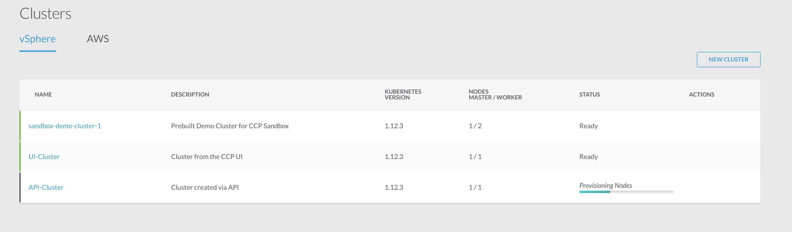
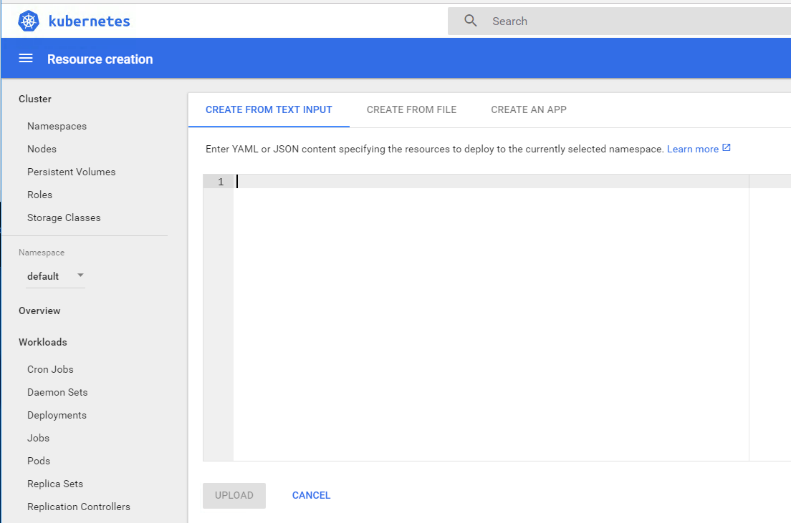

# Step 3: API Cluster Creation

Time to create our second cluster! Re-Open the API docs if you closed them and re-authenticate like you did earlier in the Lab. [Link: https://10.10.20.110/2/swaggerapi/](https://10.10.20.110/2/swaggerapi/).

Click on `Expand Endpoints` in the endpoint item entitled `2/clusters : List of cluster endpoints`.

Scroll down to the green `POST` request, which allows us to create a new cluster.

Use the following text in the BODY field, notice that these are all the same options (potentially in UUID form) which we specified from the UI.

```
{"is_harbor_enabled":false,"provider_client_config_uuid":"f610d6d4-5cd7-4a3c-937a-dbf69280dc5b","name":"API-Cluster","kubernetes_version":"1.12.3","ssh_key":"ecdsa-sha2-nistp521 AAAAE2VjZHNhLXNoYTItbmlzdHA1MjEAAAAIbmlzdHA1MjEAAACFBAHlSb9ZkXQL5/GI12258c+AIKVhDN1p1VYjvJR5oliqoR/gN/65D04BfsZWE8nk00AtJzvEVbjenwLeWuvIQsFs5AHa5uM4Fpmw3Ylpt1tB/GZHZ5Mg9sh1iLh5agSgNLWkAgCRvySmLO3fSq0IKarnQrMqId2pGUlNZr/YPP4irTvU6w== sandbox@CCP_SANDBOX_NISTP521_KEY","description":"Cluster created via API","datacenter":"CCP","cluster":"CCP","resource_pool":"CCP/Resources","networks":["VMNetwork"],"datastore":"CCPDatastore","storage_class":"vsphere","workers":1,"ssh_user":"ccpuser","type":1,"masters":1,"deployer_type":"kubeadm","ingress_vip_pool_id":"15ee6d0f-2709-4a7f-871e-71ce5c8568be","load_balancer_ip_num":4,"is_istio_enabled":false,"registries_root_ca":[""],"aws_iam_enabled":false,"aws_iam_role_arn":"","worker_node_pool":{"vcpus":2,"memory":16384,"template":"ccp-tenant-image-1.12.3-ubuntu18-3.1.0"},"master_node_pool":{"vcpus":2,"memory":16384,"template":"ccp-tenant-image-1.12.3-ubuntu18-3.1.0"},"node_ip_pool_uuid":"15ee6d0f-2709-4a7f-871e-71ce5c8568be","network_plugin":{"name":"calico","status":"","details":"{\"pod_cidr\":\"192.168.0.0/16\"}"},"deployer":{"proxy_cmd":"StrictHostKeyChecking no\nHost 15.29.3?.* !15.29.30.* !15.29.31.*\n ProxyCommand nc --proxy 10.193.231.10:8111 --proxy-type socks4 %h %p","provider_type":"vsphere","provider":{"vsphere_datacenter":"CCP","vsphere_datastore":"CCPDatastore","vsphere_client_config_uuid":"f610d6d4-5cd7-4a3c-937a-dbf69280dc5b","vsphere_working_dir":"/CCP/vm"}}}
```
It will create us a one worker node cluster called "API-Cluster".

Click the `Try it out!` button.

The API call will currently block until the cluster is provisioned (then return a 200 if successful!) So in the meantime....

Change back to the Cisco Cloud Platform UI, notice a new cluster soon appears as `Status: PROVISIONING`, just as with the UI creation.



Congratulations! You just used the CCP API to spin up a new Kubernetes cluster!

This lets us easily tie the entire lifecycle of the cluster into CI/CD deployment if necessary.

## Automating cluster access
Continuing the automated, "Kubernetes as a Service" theme; these credentials and URL's for accessing the cluster are also available via the Cisco Container Platform API.

If you still have the Swagger UI open, you will see an API call labelled `/2/clusters/{clusterUUID}/dashboard`.
Providing the UUID of your cluster to this `GET` request will return the URL of the Kubernetes dashboard.

Similarly, `/2/clusters/{clusterUUID}/env` will provide you with the authentication file, which could be used by CI/CD to then automatically deploy workloads onto the new cluster!

  

## Deploying an APP on our cluster!

Demo apps are fun, real apps are better!

We're going to use Kubernetes to deploy an installation of "OwnCloud", an open source file synchronization and sharing web-app, similar to Dropbox, Google Drive, etc.

The deployment is made up of the following Kubernetes objects:
- Deployment / Pods:         The OwnCloud application itself including a mariaDB database.
- Service / LoadBalancer:    Our real-world IP that will allow us to access the application from our enterprise.
- Persistent Volume Claims:  Cisco Container Platform has pre-configured Kubernetes to use HyperFlex storage, giving Kubernetes apps easy access to persistent storage for databases or other storage requirements.

The Kubernetes deployment manifest for our OwnCloud application is here: [Open this link in a new tab and copy the whole JSON file from the page to the clipboard.](https://developer.cisco.com/learning/posts/files/CiscoContainerPlatform-101/assets/kube-manifests/owncloud.json)

For this deployment to work, since we've hardcoded the "public" IP we want in the manifest, open and authenticate to the `Sandbox-Demo-Cluster-1` Kubernetes Dashboard.

Using the Kubernetes Dashboard, we can now deploy this App, click on `Create` at the top right of the Dashboard UI:
  

In the blank field that opens, paste the entire JSON document we just copied then click `Upload`.


(This is exactly like deploying Kubernetes applications and services from the `kubectl` command with `kubectl create -f <file.json>`, only doing it via the UI saves us from having to configure the desktop's local Kubernetes CLI.)

## Congratulations! You've created two clusters and deployed working applications!
Kubernetes was already an extremely powerful tool for fast, easy deployment and management of containerized applications. Now with Cisco Container Platform, the complexity and staffing requirements of building out and maintaining the Kubernetes infrastructure itself has been replaced by a provisioning API.

Click `Next` for the final part of this Lab; testing our newly deployed OwnCloud service!
