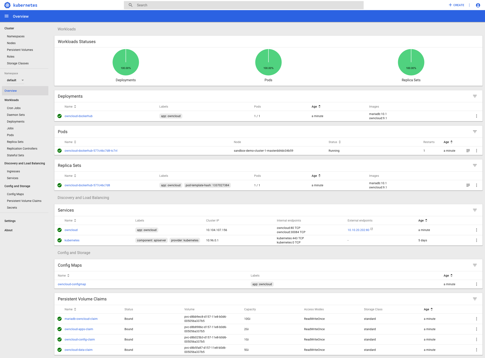
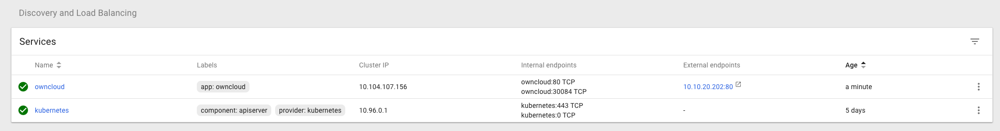
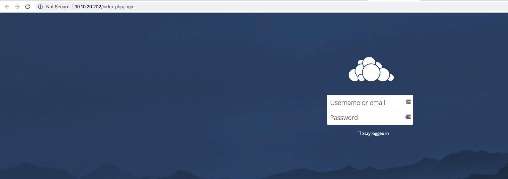
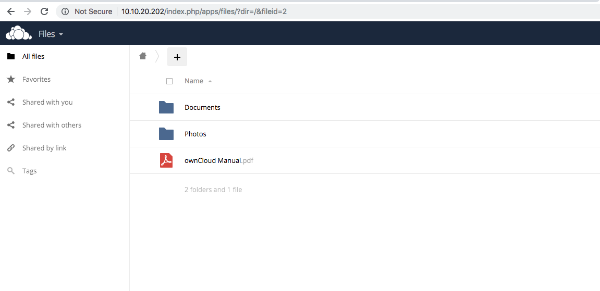

# Step 4: Testing our deployed OwnCloud App!

Once you've clicked create, Kubernetes will download the necessary container images to run OwnCloud, as well as setup persistent volumes to store OwnCloud's data and databases.

Refresh the Kubernetes UI until you see the deployment succeed (turn green).

You can see there is a deployment, multiple persistent volumes, and other items as discussed below.

Locate the "Services" section of the overview page. Here we see the IP address assigned by our Kubernetes config to our new OwnCloud app:

We have IP address `10.10.20.121` assigned to our load balancer.
We can now navigate to [http://10.10.20.121](http://10.10.20.121) to access our application!

Login with credentials `Username: demo`, `Password: demopassword`.

You will now be presented with the OwnCloud UI.

## What just happened?
If you're familiar with Kubernetes, you'll have noticed the multiple Kubernetes resources in the configuration we just pasted into the Kubernetes dashboard,

  - A `service` to provide a Virtual IP and load balancing into our app.
  - A `deployment` of the actual containerized applications we need to run.
  - A `configmap` of our configuration options, so we don't need to bake a new container image just to tweak options.

Last but by no means least,`PersistentVolumeClaim` objects; These dynamically provision blocks of persistent storage from HyperFlex to use within Kubernetes applications, allowing Kubernetes to host items such as databases and in our case, a file storage application.

If you were interested where the owncloud login credentials came from, see the `ConfigMap` and `Secrets` section of the json file we used to start our app!

# Summary
Cisco Container Platform gives you and your development teams the portability and agility of known-good Kubernetes deployments, with a cloud-like provisioning and consumption API on a fully-supported on-premise stack, starting from just three servers.

With the rise of IOT and smart-industry enabled applications demanding hybrid or local low-latency edge compute, Cisco Container Platform is the perfect way to deploy to the edge without adding unnecessary expense or complexity to your development teams' roadmap.

We hope you found this lab informative!
Feel free to extend your CCP sandbox and keep on experimenting, or check out [https://developer.cisco.com](developer.cisco.com) for more inspiration.
