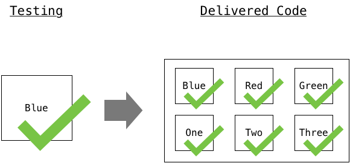
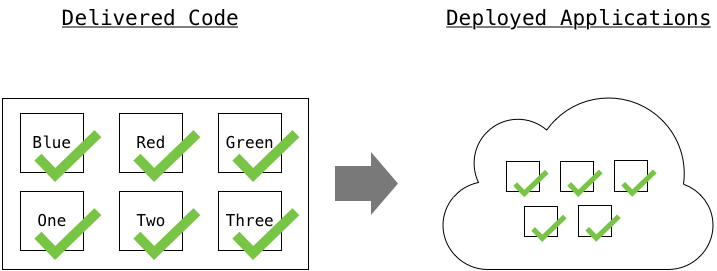

# Introduction to CI/CD

## Objective

This Learning Lab introduces you to Continuous Integration (CI) and Continuous Deployment (CD) techniques and principles designed to automate the workflow of a modern app developer.

Following on from the Microservices Track, let's build on Docker basics. You benefit from having a background using Docker to package your applications.

## Audience

* DevOps engineers
* Application developers
* IT teams addressing the developer need for Docker and Containers.

## Recap
As discussed in Docker-101; containers are a wonderful packaging and portability solution for your application. By building your code, its dependencies and simple startup scripts into a container, you can guarantee it executes consistently wherever someone runs it. Be that on the developer machine, in the QA test environment, or in production.

Many other packaging formats for applications (such as ZIP, JAR, RPM's, DEBs) cannot guarantee consistent execution. While 'baked' VM images offer the same consistency benefits, containers have a much smaller footprint. Containers just start in userspace (sharing the single OS kernel) and therefore also 'boot' near instantly.

# What is CI/CD?

## CI - Continuous Integration
Development projects often consist of many developers, all working on individual features and code. Eventually the individual work must be brought together and combined into a single code base. Individual developers should be testing their code as they work, but that code still needs reverifying when it's part of the full codebase.

Even working solo on a project, there are advantages to knowing that each time you update your code, "something else" notices the change and reruns all your code tests against the changes, making your developer process look like this:

1. Edit Code
2. Code Repository - Commit Change
3. Repeat

Instead of this;

1. Edit Code
2. Code Repository - Commit Change
3. Manually run test suites against code using command line or IDE
4. Wait for tests to complete
5. Repeat

This process is CI, automating the process of running your code base's tests against any new changes in the code.

## CP - Continuous Packaging

Technically, CI/CD Should be called CI/CP/CD, where CP stands for Continuous Packaging. Once we have tested our code changes successfully, we must package up the code to deploy into our staging or production environments.

In modern development automation, this packaging step moves into Docker containers.

All code, plus any dependencies and startup scripts are packaged into a container so that we know our app runs consistently in any destination environment.

Because we have automated CI, we can start to build a "pipeline", in which CI automatically kicks off the packaging of the software if the tests pass.

Again, even in a solo developer scenario, not having to manually run `docker build .` followed by `docker tag` and `docker push` every time you change your code, is a considerable benefit.

## CD - Continuous Deployment
Once the system packages new code and places it somewhere accessible (such as a Docker repository), the system must deploy the code so that users can take advantage of the new features or bug fixes.

If we choose to, the automation pipeline can do this automatically for each new code change, or potentially this goes through a manual "approval" step, it all depends on the developer or team configuring their CI/CD pipeline.

The rise of containers affects deployment phase of CICD the most. Deployment of software using automation used to involve spinning up new virtual machines. Then you had to automate communication with them using Puppet, Ansible, or some other configuration management tool. Finally, you have that tool upgrade or install and set up the software and its dependencies on the machines.

As the software and dependencies are already in our Docker container, we simply tell our container orchestrator (such as Kubernetes, DC/OS, Docker Datacenter, and so on) via its APIs to roll out the new version of our application containers.

Modern orchestrators can do this in a zero down time way, through strategies such as only changing one (of many) instances at a time. These improvements make it more likely to see teams enabling the full CI/CD pipeline through to production changes.

# You can build the pipeline

Ready to put your new CI/CD knowledge into practice? You build your own CI/CD pipeline and have it deploy some code updates using the DevNet Sandbox in this exercise.
