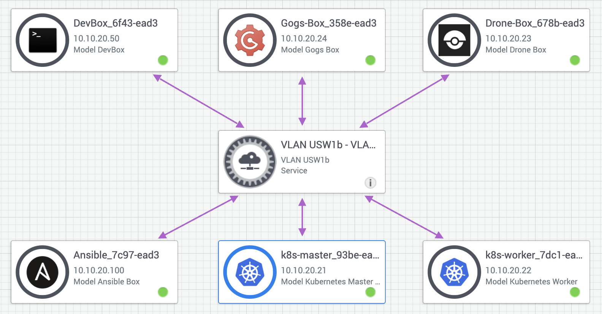
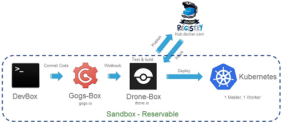
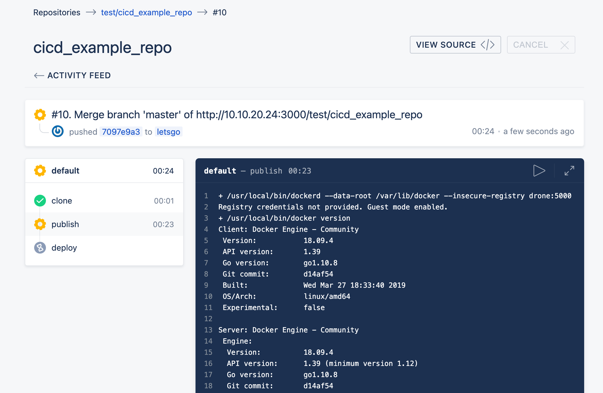
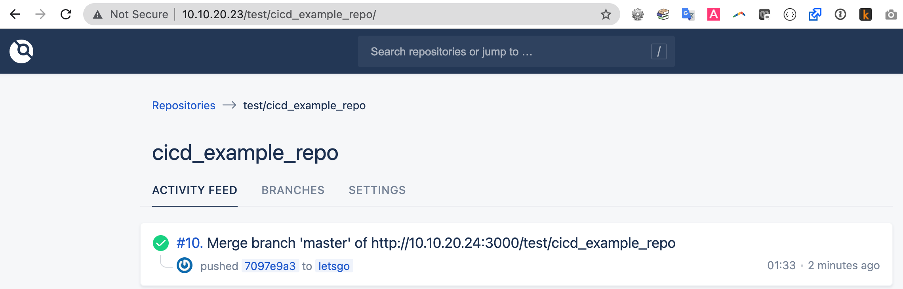
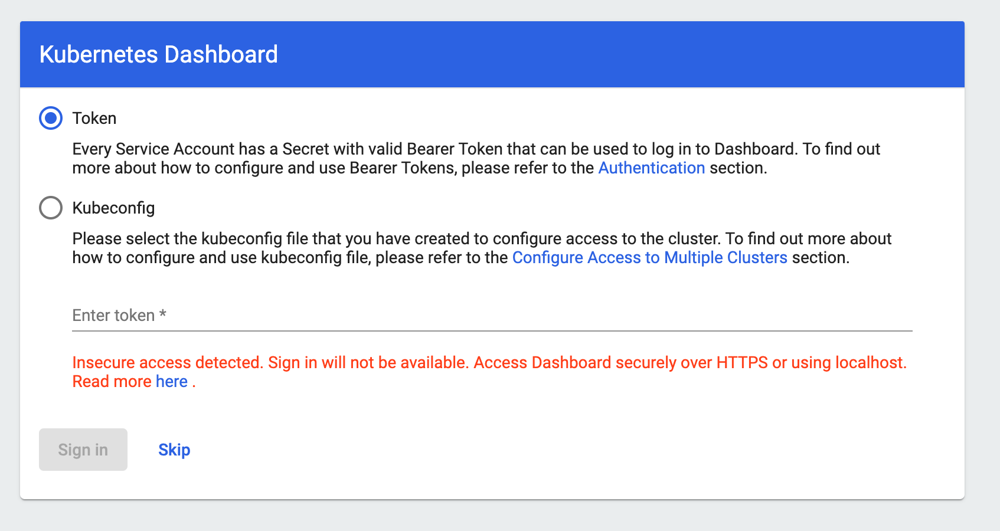
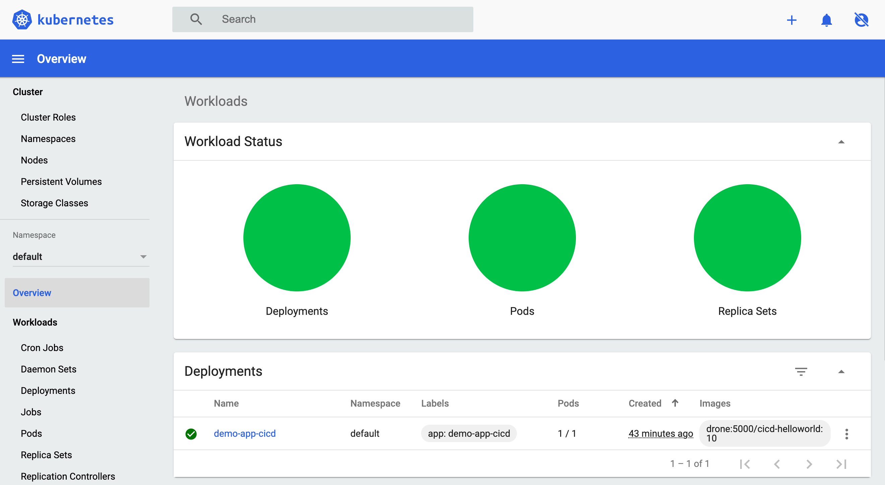
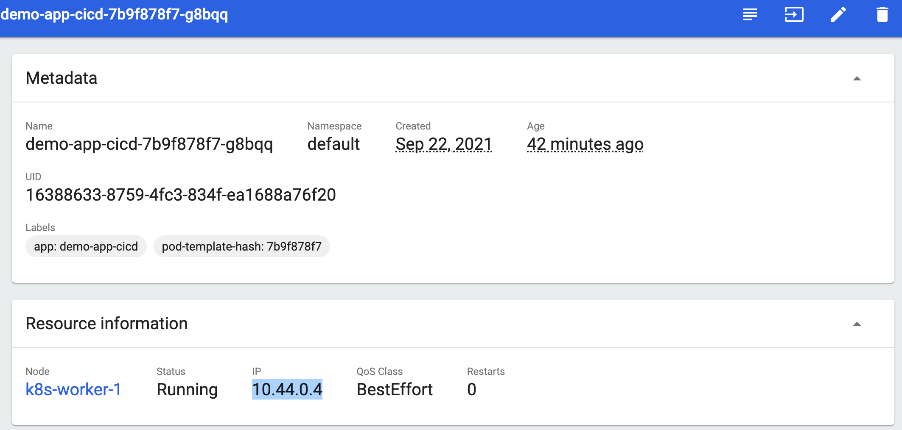

# The Tools of CI/CD
To build a CI/CD pipeline, we're going to need a few tools and services.

### 1. Git / Code repository
You need somewhere to check your code into for versioning.

Usually, this is github.com, GitHub Enterprise, GitLab, Gogs, or some other Git-based code repository system.

Code repositories can also alert other systems when a change is made (via a webhook), this is what kicks off the CI/CD pipeline.

We'll be using Gogs, a self-hosted Git server for this Lab.

### 2. CI/CD Server
A CI/CD server allows us to piece together actions for the pipeline such as test code, package code, deploy code with simple "if, then, else" type of logic.

Many tools exist in this area, with this exercise using Drone, as it allows all of the actions to be run in Docker containers, keeping the CI/CD base system clean.

Others you may have heard of include CircleCI, Concourse, Travis, and so on.

Jenkins was historically the leader in this space, one difference being that Jenkins had to be set up for each application and codebase manually. Newer CI/CD tools like Drone read their pipeline configuration from the code repository, allowing the CI/CD configuration to be versioned and managed by the developers. You use Drone in this Lab.

### 3. A Container repository
Where do you put packaged containers so that you can deploy them somewhere? Docker repositories come in public and private (self-hosted) flavors. On the DevNet Sandbox you use an internal repository for simplicity, hosted on the Drone CI/CD server.

### 4. A 'Deployment Destination'
Where do you want the pipeline to deploy new code? Any container orchestrator can be configured on a per-codebase (per pipeline) basis. In this exercise, Kubernetes becomes the deployment destination.

# Deployment 1/2: To the Sandbox!



Setting up a Kubernetes cluster, Gogs server, and Drone installation would in itself be a Learning Lab longer than this one!

We care about using these tools to make a CI/CD system, not how they are installed. So for that reason, the DevNet Sandbox team has built a CI/CD Sandbox with all the services we need pre-configured.

Anyone can reserve a DevNet Sandbox, free with a free DevNet login for up to seven days.

### A. Go to the CI/CD Sandbox.

[Click here for the CI/CD Sandbox](https://devnetsandbox.cisco.com/RM/Diagram/Index/be51af73-c9e9-4af7-89d2-42c1c71e1f09?diagramType=Topology).

Click "Reserve" and chose your duration. The system prepares a private environment containing;

- A Linux Workstation or "DevBox"
- A Drone Installation
- A Gogs Git server
- A full, two node Kubernetes cluster

Once the Sandbox is running, you receive an e-mail with VPN details. Having a VPN to the Sandbox allows us to keep the systems simple and give you full access to the devices, without risking associated abuse should they be internet facing.

### B. VPN into the CI/CD Sandbox

Details and credentials are included in the e-mail.

Once connected to the VPN, you have direct network access to all of the Sandbox services.


# Deployment 2/2: Hello World CI/CD
Our example setup is going to look like this.

We simulate a developer's laptop or desktop on the Linux DevBox. This has developer tools such as the Git client and Python installed.

Changes to the code get committed via Git to the Gogs server, which in turn tells Drone CI of the change, and then Drone tests, packages and finally deploys the code to the Kubernetes cluster.



You may think that this is a lot of configuration, but Drone gets all of its instructions from a configuration file stored *INSIDE* your code repository. That configuration file lets a single Drone server handle completely different scenarios from many teams and repositories.

## A. A sample codebase

You have a sample codebase to work with for this Lab.

Use SSH to connect to the DevBox, where the code from https://github.com/CiscoDevNet/cicd_learninglab_demo has been downloaded:

```
 cd ~/cicd_learninglab_demo
 ```

 If we take a look around this code base, you see;

 ```
[developer@devbox cicd_learninglab_demo]$ ls -la
total 44
drwxrwxr-x.  5 developer developer 4096 Sep 22 09:58 .
drwx------. 21 developer developer 4096 Sep 22 12:10 ..
drwxrwxr-x.  2 developer developer   69 Sep 22 09:58 c
-rw-rw-r--.  1 developer developer 6119 Sep 22 09:58 cluster.yml
-rw-rw-r--.  1 developer developer 2287 Sep 22 09:58 contributing.md
-rw-rw-r--.  1 developer developer  300 Sep 22 09:58 demo-app-cicd.yaml
-rw-rw-r--.  1 developer developer  144 Sep 22 09:58 Dockerfile
-rw-rw-r--.  1 developer developer  516 Sep 22 09:58 .drone.yml
drwxrwxr-x.  8 developer developer 4096 Sep 22 09:58 .git
drwxrwxr-x.  2 developer developer   70 Sep 22 09:58 go
-rw-rw-r--.  1 developer developer   12 Sep 22 09:58 index.html
-rw-rw-r--.  1 developer developer 1416 Sep 22 09:58 README.md
```

#### index.html
Our simple HTML example app.

#### Dockerfile
Our Docker configuration that hosts the `index.html` file with a simple Python web server.

#### .drone.yml
This is where the CI/CD magic happens, so have a look in the file. You can see configuration for the Drone CI/CD server, telling Drone what to do with the code repository when it detects a change.

```
[developer@devbox cicd_learninglab_demo]$ cat .drone.yml
pipeline:
  publish:
    image: plugins/docker
    dockerfile: Dockerfile
    repo: drone:5000/cicd-helloworld
    registry: drone:5000
    insecure: true
    tags: "${DRONE_BUILD_NUMBER}"
  deploy:
    image:  devnetsandbox/kube
    kubernetes_server: http://master:8001
    kubernetes_token: <Your Kubernetes Token>
    namespace: default
    deployment: demo-app-cicd
    container: cicd-helloworld
    repo: drone:5000/cicd-helloworld
    registry: drone:5000
    insecure: true
    tag: "${DRONE_BUILD_NUMBER}"
```

Our Simple Drone configuration is saying "check out any new code from the Git repository at `drone:5000/cicd-helloworld` and use the `Dockerfile` within to create the Docker image. Upload this image to the Docker repository at `drone:5000` and tag the image as version `<version value>`.

The `deploy:` section instructs the creation of a new deployment called `demo-app-cicd` on the local Kubernetes cluster at `http://master:8001`. The deployment runs the contents of the container we just built, in the earlier stage, which Kubernetes pulls from the Docker repository at `drone:5000/cicd-helloworld`.

### How does Drone know a Docker build? Or what Kubernetes is?
Good question!

Drone uses plugins, you'll notice in both the `publish:` and `deploy:` sections of the configuration the `image:` line, this tells Drone what Drone plugins to use for each section. Plugins in Drone are themselves Docker containers.

<!--
You can see for the `deploy:` section, we are using the plugin `trxuk/kube`, this is a custom plugin hosted on a public Docker repository. You can dig into how this plugin works if you wish by looking at the source here: https://github.com/matjohn2/sbx_cicd/tree/master/kube.
-->
## B. Make it Real
So Drone takes the actions based on the `.drone.yml` when the code changes in the Git repo, so push the code to the internal Sandbox Git repo!

A repository has already been set up in `gogs` and tied to `drone` via a webhook (so Drone knows when new commits are made to the code).

Add a new destination Git server to the repository (also known as a Git remote) and send the code to Gogs.

```
[cicd_learninglab_demo]# git remote add cicd http://10.10.20.24:3000/test/cicd_example_repo.git
```

Check out a new branch to push to the Gogs repository.
```
[cicd_learninglab_demo]# git checkout -b letsgo
```
Enter the Git credentials username:test and password:test at the command line:
```
Username for 'http://10.10.20.24:3000': test
Password for 'http://test@10.10.20.24:3000':
```

Drone immediately notices the push and starts running the pipeline. You can watch the progress in the Drone UI by navigating to it in a web browser:
[http://10.10.20.23/test/cicd_example_repo]().

The Drone login is *test/test*.

Notice that Drone gives this `build` a number (the first change Drone has noticed to this repository) and has a section for each `plugin` in the `.drone.yml` file; publish and deploy.



Once the build has finished, the indicator turns green if successful. Don't forget, the idea of CI/CD is to build, TEST and publish. Most pipeline configurations would have a `publish:`, `test:`, and `deploy:` section at the very least.



So your application has been packaged and deployed. You have other ways to view the application. 

Let's see the output in the Kubernetes UI, available at:
[http://10.10.20.21:8001/api/v1/namespaces/kubernetes-dashboard/services/kubernetes-dashboard/proxy/#/login](http://10.10.20.21:8001/api/v1/namespaces/kubernetes-dashboard/services/kubernetes-dashboard/proxy/#/login) from your local computer and from RDP on the DevBox, use [http://10.10.20.21:8001/api/v1/namespaces/kubernetes-dashboard/services/kubernetes-dashboard:80/proxy](http://10.10.20.21:8001/api/v1/namespaces/kubernetes-dashboard/services/kubernetes-dashboard:80/proxy). As you can see from the message, you cannot log in as an Admin, so click the Skip link here.



> **Note**: If you need the Kubeconfig file, find it at the root of the DevBox in `/home/developer/admin.conf`. 



Here we can see the `deployment` created by Drone. If you click on the  Workloads > Pods tab on the left, and then click the `demo-app-cicd-nnnnnn` links, you can also see the IP address assigned to the deployment:



## C. Access the App
So you have a web server, running in Kubernetes with the HTML "app" code inside. Let's look at the app. Note the IP address in the Workloads > Pods > Metadata page in the Kubernetes dashboard.

Due to the current CICD Sandbox setup, there is no route from your VPN client to the Kubernetes workloads, so you have to test your app by using SSH to connect to one of the servers in the Sandbox.

SSH to the Kubernetes cluster:

```
ssh developer@10.10.20.21
#password is C1sco12345
```

Then run the command line HTTP browser, `curl`, to see your app. Notice the IP for the app is the one from the "Metadata" page in the Kubernetes UI, yours may differ.

```
[developer@netmaster ~]# curl http://10.100.170.97
Hello World 
```

## *EXCELLENT!*
Our App is running and serving clients.

Now let's use CI/CD to automate another change.
