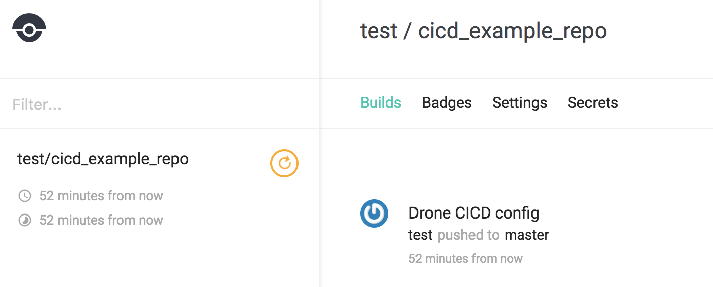
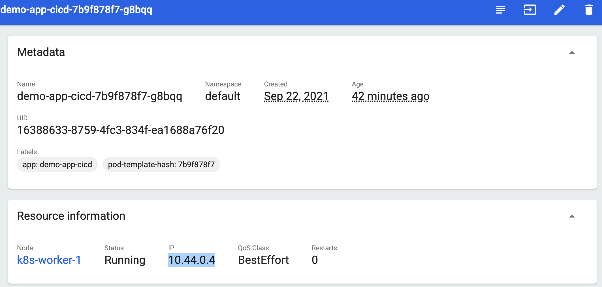

# The Tools of CI/CD
To build our CI/CD pipeline, we need a few tools and services.

### 1. Git/Code repository
We need somewhere to check our code into for versioning.

Usually, this is github.com, GitHub Enterprise, GitLab, Gogs, or some other git-based code repository system.

Code repositories can also alert other systems when a change is made (via a webhook), this is what kicks off our CI/CD pipeline.

We'll be using Gogs, a self hosted Git server for this Lab.

### 2. CI/CD Server
A CI/CD server allows us to piece together actions for our pipeline such as test code, package code, deploy code with simple "if, then, else" style logic.

Many tools exist in this area, with our favorite being Drone, as it allows all of the actions to be run in Docker containers, keeping the CI/CD base system clean.

Others you may have heard of include CircleCI, Concourse, Travis etc.

Jenkins was historically the leader in this space, the difference being that Jenkins had to be setup for each application and codebase manually; newer CI/CD tools like drone read their pipeline configuration from the code repository, allowing the CI/CD configuration to be versioned and managed by the developers.

We'll be using Drone in this Lab.

### 3. Container repository
Where do we put our packaged containers so that we can deploy them somewhere? Docker repositories come in public and private (self hosted) flavors, we'll be using an internal repository for simplicity, hosted on the drone CI/CD server.

### 4. Deployment Destination
Where do we want our pipeline to deploy our new code, any container orchestrator can be configured on a per-codebase (per pipeline) basis, we'll be using Kubernetes as our deployment destination.

# Deployment 1/2: To the Sandbox!


Setting up a Kubernetes cluster, Gogs server, and Drone installation would in itself be a Learning Lab longer than this one!

We care about using these tools to make a CI/CD system, not how they are installed, for that reason, our DEVNET Sandbox team has built a CI/CD Sandbox, with all the services we need pre-configured for our convenience.

Anyone can reserve a Sandbox, free of charge (with a free DevNet login) for up to 7 days. To reserve the CI/CD Sandbox, follow the below steps:

### 1. Go to the CI/CD Sandbox

[Click here for the CI/CD Sandbox](https://devnetsandbox.cisco.com/RM/Diagram/Index/be51af73-c9e9-4af7-89d2-42c1c71e1f09?diagramType=Topology).

Click "Reserve" and chose your duration, we'll then prepare you your own private environment containing;

- A Linux Workstation
- A Drone Installation
- A Gogs git server
- A full, two node Kubernetes cluster

Once the sandbox is running, you'll receive an e-mail with VPN details. Having a VPN to the Sandbox allows us to keep the systems simple and give you full access to the devices, without risking associated abuse should they be internet facing.


### 2. VPN into the CI/CD Sandbox

Details and credentials will be included in the e-mail.

You will then have direct network access to all of the Sandbox services.


# Deployment 2/2: Hello World CI/CD
Our example setup is going to look like this.

We'll simulate the developers laptop/desktop on the 'DevBox', this has developer tools such as the git client and python installed.

Changes to our code get committed via git to our Gogs server, which in turn tells Drone CI of the change, drone tests, packages and finally deploys our code to our Kubernetes cluster.


You may think that this is a lot of configuration, but drone actually get's all of it's instructions from a configuration file stored *INSIDE* your code repository, that lets a single drone server handle completely different scenarios from many teams and repositories.


## 1. Our sample codebase

We have a sample codebase to work with for this Lab, lets download it to our 'DevBox';

SSH to the devbox, clone the git repository;

```
 ssh developer@10.10.20.50
 # password is cisco123
 git clone https://github.com/CiscoDevNet/cicd_learninglab_demo.git
 cd cicd_learninglab_demo
 ```

 If we take a look around our codebase, we have;

 ```
[developer@devbox cicd_learninglab_demo]# ls -la
total 32
drwxrwxr-x. 3 developer developer 4096 Dec 16 21:29 .
drwx-----. 18 developer developer 4096 Dec 16 21:29 ..
-rw-rw-r--. 1 developer developer 2287 Dec 16 21:29 contributing.md
-rw-rw-r--. 1 developer developer  145 Dec 16 21:29 Dockerfile
-rw-rw-r--. 1 developer developer  482 Dec 16 21:29 .drone.yml
drwxrwxr-x. 8 developer developer 4096 Dec 16 21:29 .git
-rw-rw-r--. 1 developer developer  167 Dec 16 21:29 index.html
-rw-rw-r--. 1 developer developer 1146 Dec 16 21:29 README.md
```

#### index.html
Our simple HTML "app".

#### Dockerfile
Our Docker configuration that will host the `index.html` file with a simple Python web server.

#### .drone.yml
This is where the CI/CD Magic happens, have a look in the file, you can see configuration for our drone CI/CD server, telling drone what to 'do' with our code repository when it detects a change.

```
[root@devbox cicd_learninglab_demo]# cat .drone.yml
pipeline:
  publish:
    image: plugins/docker
    dockerfile: Dockerfile
    repo: drone:5000/cicd-helloworld
    registry: drone:5000
    insecure: true
    tags: latest
  deploy:
    image:  trxuk/kube
    kubernetes_server: http://master:8001
    namespace: default
    deployment: demo-app-cicd
    container: cicd-helloworld
    repo: drone:5000/cicd-helloworld
    registry: drone:5000
    insecure: true
    tag: latest
```

Our Simple drone configuration is saying "check out any new code from the GIT repository at `drone:5000/cicd-helloworld`" and use the Dockerfile within to create our Docker image.

Upload this image to our Docker repository at `drone:5000` and tag the image as version `latest`.

Then, assuming the build/publish step did not error, otherwise the build will stop. You don't want to deploy errors in your code!

The `deploy:` section is told to create a new deployment called `demo-app-cicd` on our local Kubernetes cluster at `http://master:8001`, the deployment will run the contents of the container we just built, in the earlier stage, which Kubernetes will be told to pull from our Docker repository `drone:5000/cicd-helloworld`.

### How does drone know a Docker build? Or what Kubernetes is?
Good question!

Drone uses plugins, you'll notice in both the `publish:` and `deploy:` sections of the configuration the `image:` line, this tells drone what drone plugins to use for each section, plugins in drone are themselves Docker containers.

You can see for the `deploy:` section, we are using the plugin `devnetsandbox/kube`, this is a custom plugin hosted on a public Docker repository. You can dig into how this plugin works if you wish by looking at the source here: [https://github.com/matjohn2/sbx_cicd/tree/master/kube]()

## 2. Make it Real
So drone will take the actions based on our `.drone.yml` when the code changes in the GIT repo, so lets push our codebase to our internal Sandbox git repo!

A repository has already been setup in `gogs` and tied to `drone` via a webhook (so drone knows when new commits are made to our codebase).

We add a new 'destination git server' to our codebase (also known as a git remote) and send our code to gogs.

```
[cicd_learninglab_demo]# git remote add cicd http://10.10.20.24:3000/test/cicd_example_repo.git
[cicd_learninglab_demo]# git push cicd master
# GIT credentials when prompted are test/test
```

Drone will immediately notice the push and start running the pipeline! We can see this via the drone UI, nativate in a web browser to:
[http://10.10.20.23/test/cicd_example_repo]()

The drone login is *test/test*



Notice that drone gives this `build` a number (the first change drone has noticed to this repository) and has a section for each `plugin` in our `.drone.yml`; publish and deploy.


Once the build has finished, it will turn green if successful; Don't forget, the idea of CI/CD is to build, TEST and publish, most pipeline configurations would have a `publish:`, `test:` and `deploy:` section at the very least.


So our application has been packaged and deployed! Congratulations!

Let's see the output in the Kubernetes UI, available at: [http://10.10.20.1:8001/api/v1/namespaces/kube-system/services/kubernetes-dashboard/proxy/#!/workload?namespace=default]()


Here we can see our `deployment` created by Drone, if you click on the  "Services" tab on the left, you can also see the IP address assigned to our deployment;


## 3. Access our APP!
So we have a web server, running in Kubernetes with our HTML "app" code inside! Let's see it!

*Due to the current CICD sandbox setup, there is no route from your VPN client to the Kubernetes workloads, so we'll have to see our app by SSH'ing to one of the servers in the Sandbox, this will be resolved and the instructions updated soon!*

SSH to our Kubernetes cluster:

```
ssh root@10.10.20.1
#password is cisco123
```

Then run the command line HTTP browser, curl, to see our app; notice the IP for the app is the one from the "services" page in the Kubernetes UI, yours may differ:



```
Last login: Tue Sep 19 07:41:59 2017 from devbox.abc.inc
[root@netmaster ~]# curl http://10.100.170.97
<html>
<header><title>CICD Learning Lab Demo App</title></header>
<body>
<h1> Hello world! </h1>
<p>
Warm regards from the CICD Learning Lab demo app!
</body>
</html>
[root@netmaster ~]#
```

## *EXCELLENT!*
Our App is running and serving clients.

Now let's use CI/CD to automate another change!
