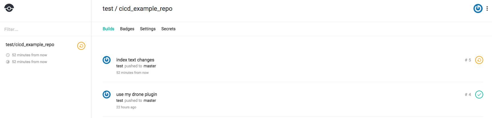
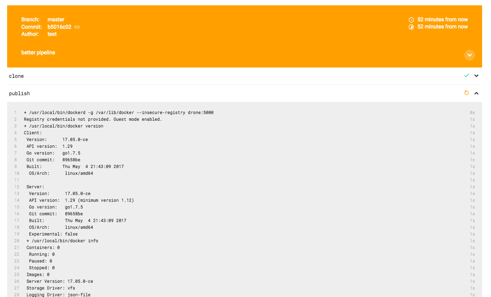
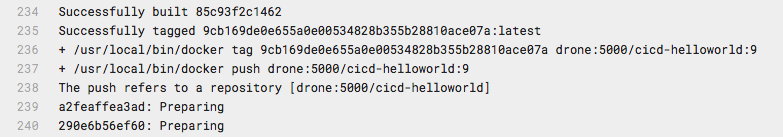
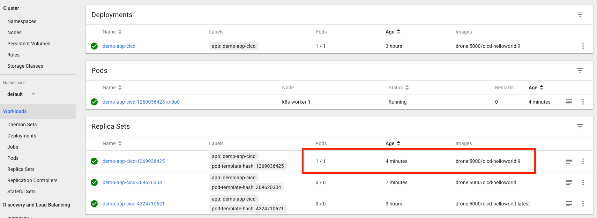

# CI/CD - Making Changes!


Making a change to the application is as simple as modifying the repository and committing the changes, CI/CD takes care of the rest.

From the DevBox, edit the `index.html` file to contain something else;

```
-Warm regards from the CICD Learning Lab demo app!
+The warmest regards from the CICD Learning Lab demo app!
```

Then commit those changes to the GOGS git repository:

```
git add index.html
git commit -m "index text changes"
git push cicd letsgo
# gogs credentials are test/test
```
This kicks off a new build in Drone. Notice that Drone includes the Git commit message from the change, in this case, "index text changes".



(Reminder, Drone UI is at: [http://10.10.20.25/test/cicd_example_repo/](http://10.10.20.25/test/cicd_example_repo/)).
<!--
Once the build has succeeded and turned green in Drone, however, the simple pipeline configuration uses the tag `latest` for all the builds. Kubernetes will not update the deployment from `latest` to `latest` as it looks the same.

To make the changes reflect in production, most people use version tags instead of `latest`.

Since the pipeline configuration is just another file in the code repo, we can edit the CI configuration just as easily.

## 2. Change the CICD Pipeline

On the DevBox, edit the `.drone.yml` file and replace the following lines:

```
tags: latest
tag: latest
```
with

```
tags: ${DRONE_BUILD_NUMBER}
tag: ${DRONE_BUILD_NUMBER}
```

The full `.drone.yml` should now look as follows;

```
pipeline:
  publish:
    image: plugins/docker
    dockerfile: Dockerfile
    repo: drone:5000/cicd-helloworld
    registry: drone:5000
    insecure: true
    tags: "${DRONE_BUILD_NUMBER}"
  deploy:
    image:  devnetsandbox/kube
    kubernetes_server: http://master:8001
    kubernetes_token: <Your Kubernetes token>
    namespace: default
    deployment: demo-app-cicd
    container: cicd-helloworld
    repo: drone:5000/cicd-helloworld
    registry: drone:5000
    insecure: true
    tags: ${DRONE_BUILD_NUMBER}
    tag: "${DRONE_BUILD_NUMBER}"
```

This will tell Drone to use the Drone current build number instead of the word `latest` for each of the Docker images we produce.

Next, use Git to add and commit the drone changes, just like we did with `index.html`;

```
 git add .drone.yml
 git commit -m "better pipeline"
 git push cicd letsgo
```

Going back to the drone UI, we can see the new build. By expanding the `publish` section in the UI, we can get a live feed of the commands being run; notice when we get to the point of uploading the new container image, it now has a version tag as a number, not just `latest`:


in my case, it's build `9`;


## SUCCESS!
Going back to the Kubernetes UI, you will see from the "workloads" page that Kubernetes has now noticed the change from deployment version `latest` to deployment version `9` (or another number in your case).

-->

Checking the app again via `curl` from the Kubernetes server, shows that with the new versioning, the new app content has finally been deployed!

```
[developer@devbox cicd_learninglab_demo]# ssh developer@10.10.20.21
developer@10.10.20.21's password:
Last login: Tue Sep 19 10:14:18 2017 from devbox.abc.inc
[developer@netmaster ~]# curl http://10.100.170.97
<html>
<header><title>CICD Learning Lab Demo App</title></header>
<body>
<h1> Hello world! </h1>
<p>
The warmest regards from the CICD Learning Lab demo app!
</body>
</html>
[root@netmaster ~]#
```

Future app changes take effect immediately with the following process, as we have proper version numbering for the Docker images:

```
# edit index.html
git add index.html
git commit -m "new changes"
git push cicd letsgo
```

Congratulations on building your first CI/CD pipeline with Docker, Drone, and Git!

# More Information.
Drone has a wide number of existing plugins for testing, packaging and deployment targets, see the documentation pages here:

[http://readme.drone.io/](http://readme.drone.io/)
