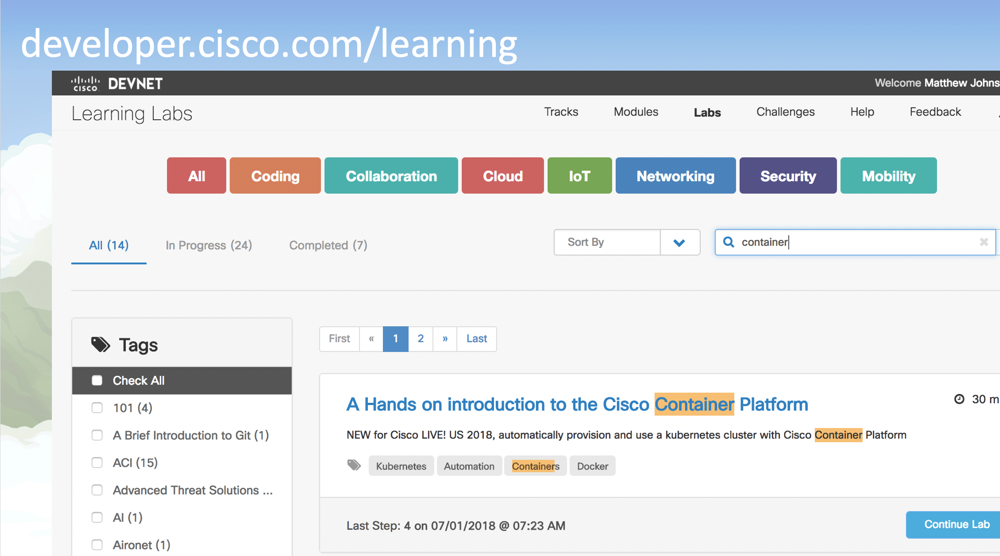
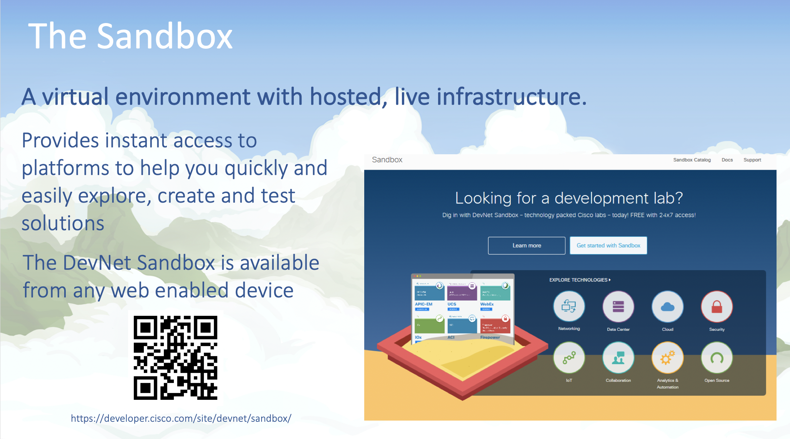
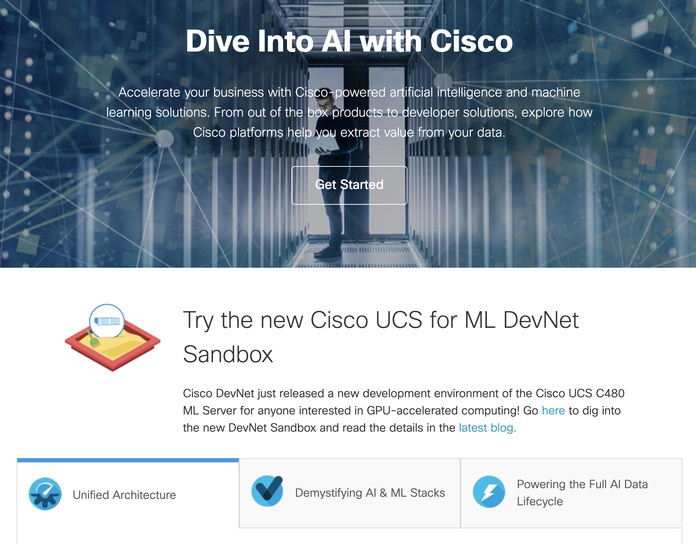
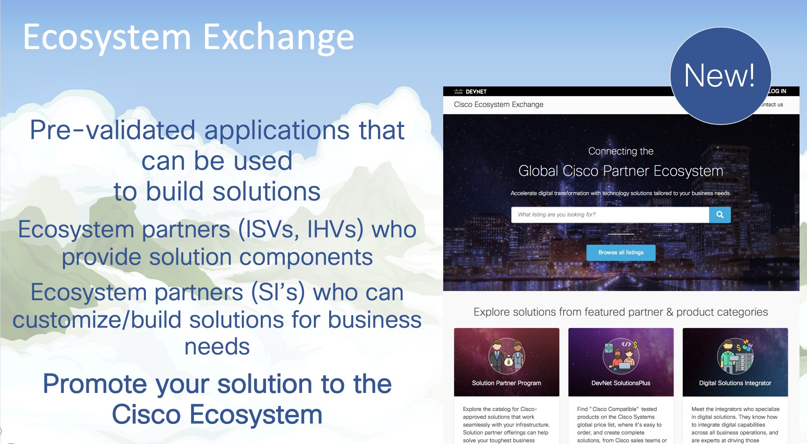
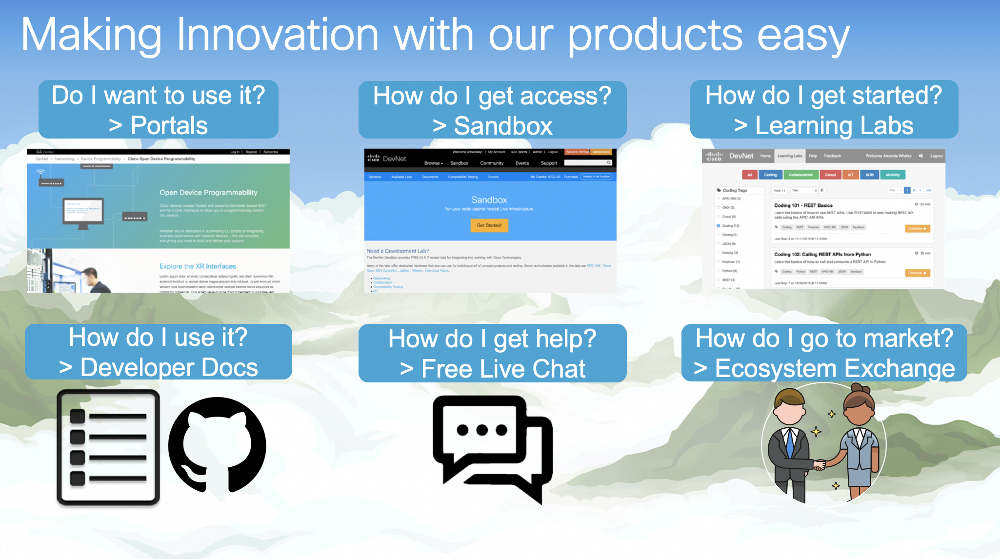

# DEVNET at Google NEXT!

## Hello!

If you can't be at Google NEXT with us this week in San Francisco, you can still get the latest on DEVNET and our resources for AI/ML and Hybrid/Edge deployments right here!

## What is DEVNET?
If you've never heard of DEVNET before, no problems! DEVNET is Cisco's developer platform. We aim to provide you with everything you need to develop with, on, or in partnership with our products and services; wherever you are in the world!

We do this through a number of free offerings at [developer.cisco.com](https://developer.cisco.com), one of which you're using right now! The learning labs!

### Learning Labs

Learning labs provide step by step instructions for a given solution or product, designed to get you up and running with hands on examples using the products API's and often providing sample code. They go hand in hand with our sandbox environments. [developer.cisco.com/learning](https://developer.cisco.com/learning)

### Sandboxes

The DEVNET sandbox gives you instant access to hosted, live infrastructure, allowing you to test, develop and innovate ontop of our products and services. Now you have a test lab for your development efforts without the hastle or cost of extra equipment, completely free!

Wondering where to start? Try one of the learning labs!

[developer.cisco.com/sandbox](https://developer.cisco.com/sandbox)

### Product Pages

DEVNET also provides development-focused product and solution pages covering the best resources for a specific product or area.

If you're here you've probably already seen the [Cisco & Google partnership page](https://developer.cisco.com/google) as one such example.

Check out our [Cloud DEV Center](https://developer.cisco.com/cloud), [SDWAN Automation Center](https://developer.cisco.com/sdwan) and [AI/ML solution pages](https://developer.cisco.com/ai) for up to date resources on developing for Hybrid and Edge compute and Inference!

### Ecosystem Exchange

Our new ECOSYSTEM EXCHANGE provides a place for Cisco's global network of partners and customers to find pre-built integrations, third party products and services built ontop of Cisco's API's and integrations!

As a developer or problem solver integrating with Cisco products or data feeds, Ecosystem Exchange allows you to get your solution in front of a huge audience!

## So Much More!

DEVNET also offers free developer-focused community support, developer documentation and more, all from [developer.cisco.com](https://developer.cisco.com), and all for free!

We hope you've enjoyed our whistle stop tour of DEVNET, to keep up with all the goings-on from DEVNET at Google NEXT, follow us on twitter, [@CiscoDEVNET](https://twitter.com/CiscoDevNet)
