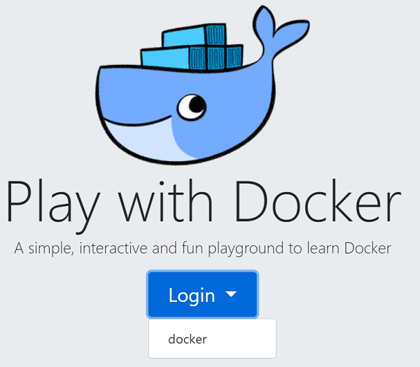
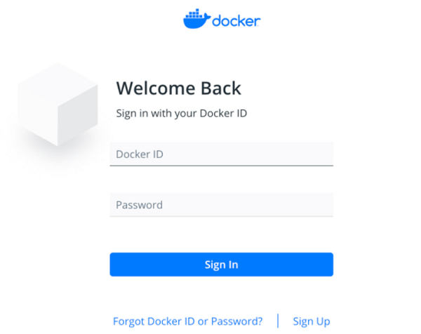
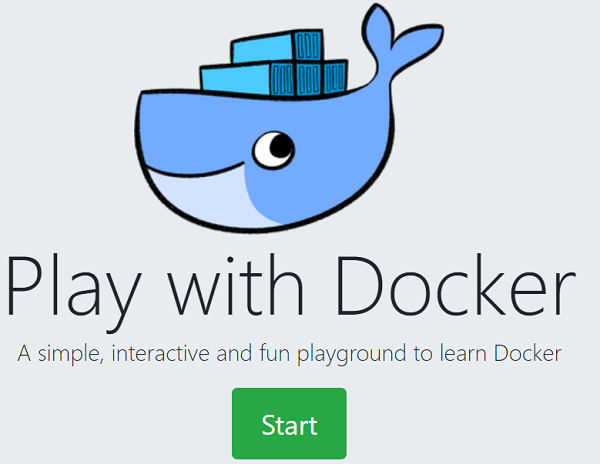
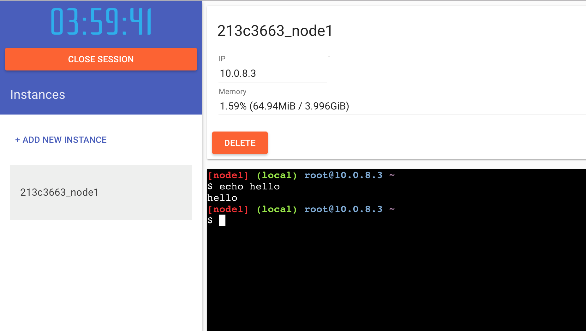
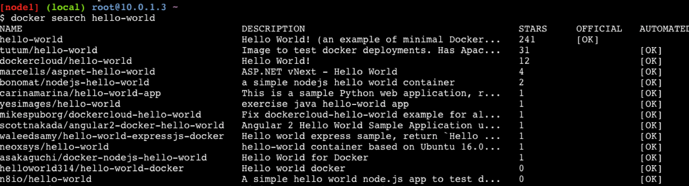
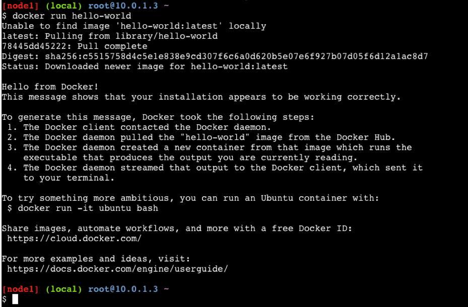

# Docker 101

## Objective

This Learning Lab introduces Docker, a tool suite for building, sharing, and deploying containers. Use this Learning Lab to build, deploy, and optionally share your first Docker container. For more information about containers, see the [Containers-101](https://developer.cisco.com/learning/lab/containers-101/step/1) Lab.
Further reading is available in the excellent Docker introduction at [imapex.io](https://github.com/imapex-training/mod_adv_docker/blob/master/README.md). 

## For best results
This is a hands-on Lab, but each example builds on the previous and explains why you run the commands. If you just skip to each command to run, without reading the text in between, you will not learn anything.

## Audience

* DevOps engineers
* Application developers
* System Architects and Engineers
* IT teams addressing developer needs for Docker and Containers

## Prerequisite

 * Install Docker on your system.
 * Create your Docker ID.
  For more information about creating the Docker ID, see [Docker docs](https://docs.docker.com/docker-id/).

## Installing Docker
The Docker engine runs and manages containers on a host machine. The Docker client tools control the Docker engine. Both the Docker engine and the Docker client tools are now distributed by default as part of many Linux distributions. The engine and client tools are also available for download directly from [Docker.com](http://www.docker.com).

* To install and configure Docker on your Window system, see [Install Docker Desktop on Windows](https://docs.docker.com/docker-for-windows/install/).
* To install and configure Docker on your Mac system, see [Install Docker Desktop on Mac](https://docs.docker.com/docker-for-mac/install/).


## A Browser-Based Playground

For the hands-on sessions in this Learning Lab, we use an in-browser Docker playground called [play-with-docker.com](http://labs.play-with-docker.com/).

The play-with-docker.com site provides access to a full VM running Docker directly in a web browser, making it easy to work with Docker from any device.

1. Navigate to [play-with-docker.com](http://labs.play-with-docker.com/) in a browser.
    The **Play with Docker** page is displayed.
2. In the **Play with Docker** page, choose **docker** from the **Login** drop-down list as shown below.

     
     
     The **Welcome Back** page is displayed.
3. In the **Welcome Back** page, enter the **Docker ID**, **Password**, and then click **Sign In**.

     
     
     The **Play with Docker** page is displayed.
4. In the **Play with Docker** page, click **Start** and continue to play-with-docker.com.

      
5. Click **Add New Instance**.
    The play-with-docker.com site creates and displays a terminal session in the browser. The rest of this Learning Lab uses the in-browser terminal session to work with Docker.
   
6. To confirm that the Docker is available, execute the following command at the prompt.
   The in-browser terminal session starts up with Docker already installed. 
   ```
   docker -v
   ```    
   Output will look similar to the following:  
   ```
   Docker version 1.13.1-rc1, build 2527cfc
   ```

# Getting and Running a Docker Container

The simplest way to use Docker is to run an existing public image that's available from [Docker Hub](https://hub.docker.com/).

Docker Hub is a public exchange for sharing Docker containers. Other Docker sharing sites are available, but we'll take advantage of the fact that Docker's command-line interface searches DockerHub by default.

To run a publicly-available Docker Container, follow these steps:

1. In the browser terminal, execute the following command to find the "hello-world" image:

    `docker search hello-world`

    

   Docker searches the public DockerHub repositories and finds the "hello-world" image.
   You can see that Docker has found the "hello-world" image. Let's run it.

2. Execute the following command to run the hello-world:

   `docker run hello-world`
   
      

   Docker first checks to see whether the "hello-world" image is available locally. If not, Docker automatically downloads it from DockerHub. Docker sets up the container to run locally, ensuring its isolation from other processes. Once the preparations are made, Docker runs the image.

Congratulations! You just ran your first Docker container!

The following sections explain what happened behind the scenes, and how to create your own Docker images.
