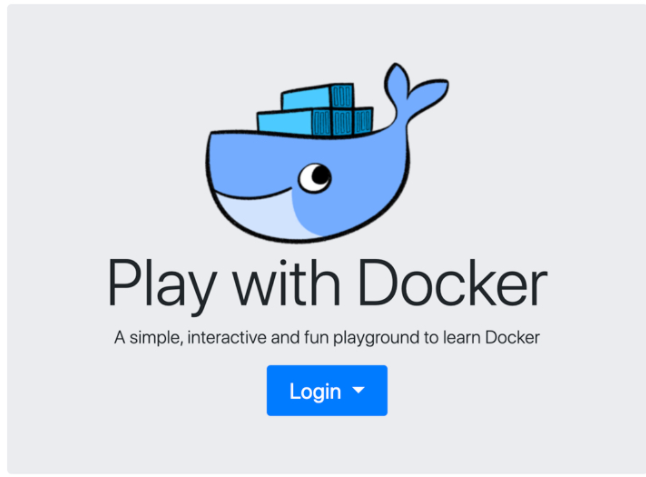
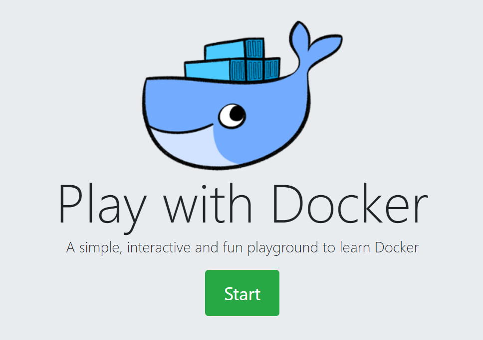

# Docker 101

## Objective

This Learning Lab introduces Docker, a tool suite for building, sharing and deploying __containers__. (For more information about containers, see the Containers-101 lab.) Use this Learning Lab to build, deploy, and optionally share your first Docker container.

## For best results
This is a hands-on Lab, but each example builds on the previous and explains *why* you run the commands. If you just skip to each command to run, without reading the text in between, you will not learn anything.

## Audience

* DevOps engineers
* Application developers
* System Architects and Engineers
* IT teams addressing developer needs for Docker and Containers

## Content Notice

Thanks to the Cisco Live EU 2017 workshop "Introduction to Containers" for portions of this learning lab. Further reading is available in the excellent docker introduction at [imapex.io](https://github.com/imapex-training/mod_adv_docker/blob/master/README.md).

## Installing Docker

The __Docker engine__ runs and manages containers on a host machine. The __Docker client tools__ interact with and control the Docker engine. Both the Docker engine and the Docker client tools are now distributed by default as part of many Linux distributions.

The engine and client tools are also available for download directly from [Docker.com](http://www.docker.com).

## A Browser-Based Playground

For the hands-on sessions in this Learning Lab, we wll use an in-browser Docker playground called [play-with-docker.com](http://labs.play-with-docker.com/).

The play-with-docker.com site provides access to a full VM running Docker directly in a webbrowser, making it easy to work with Docker from any device.

1. Navigate to [play-with-docker.com](http://labs.play-with-docker.com/) site in a browser. 
2. Choose **docker** from the **Login** drop-down list. 
   
3. Enter the **Docker ID**, **Password**, and then click **Sign In**. 
     
4. Click **Start** and continue to play-with-docker.com.  
     
5. Click __ADD NEW INSTANCE__.
The play-with-docker.com site creates and displays a terminal session in the browser. The rest of this Learning Lab uses the in-browser terminal session to work with Docker.
   
6. Confirm that Docker is available.
 The in-browser terminal session starts up with Docker already installed. To confirm that Docker is available, issue the following command at the prompt:  
   ```
   docker -v
   ```    
   Output will look something like this:  
   ```
   Docker version 1.13.1-rc1, build 2527cfc
   ```

# Getting and Running A Docker Container

The simplest way to use Docker is to run an existing public image that's available from [Docker Hub](https://hub.docker.com/).

Docker Hub is a public exchange for sharing Docker containers. Other Docker sharing sites are available, but we'll take advantage of the fact that Docker's command-line interface searches DockerHub by default.

To run a publicly-available Docker Container, follow these steps:

1. Search for a container named "hello-world". Run the command `docker search hello-world` to find the "hello-world"" image:

   

   Docker searches the public DockerHub repositories and finds the "hello-world" image.

   We can see that Docker has found the "hello-world" image. Let's run it.

2. Run hello-world by executing the following command:  
   ```
   docker run hello-world
   ```  
      

   Docker first checks to see whether the "hello-world" image is available locally. If not, Docker automatically downloads it from DockerHub. Docker sets up the container to run locally, including ensuring its isolation from other processes. Once the preparations are made, Docker runs the image.

Congratulations! You just ran your first Docker container!

The following sections explain what happened behind the scenes, and how to create your own Docker images.
