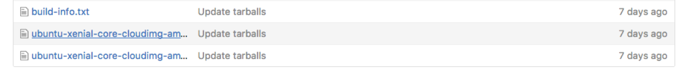

# Creating a Docker image

How did the author of the "hello-world" image make it? Because it's
available on the public DockerHub repository, we can inspect the image
and find out.

Browse to [the "hello world" web
page](https://hub.docker.com/_/hello-world/) to see details describing
the Docker image.


 One of those details is a link to the __Dockerfile__, the file that
defines the image.


## The Dockerfile

Every Docker image, from a simple one like "hello-world" to a full,
complex application, is defined by a __Dockerfile__. The Dockerfile is
a text file that describes programs and resources that become part of
the Docker image. An author creates a Docker image by assembling
application source code and other resource files and writing a
Dockerfile that collects and assembles them into a working container
image.

To actually create the container image, the author executes the
`docker build` command from the directory that contains the
Dockerfile. Docker reads the Dockerfile and follows the instructions
in it to build the container image. Once the Docker image is built,
the author pushes it to the public repository on DockerHub, making it
available to everyone.

In order to simplify the Dockerfile and the process of building the
image, most authors store their Dockerfiles together with related
application code in a revision-control repository. The "hello-world"
repository illustrates this practice:


All of the files used in this very simple container are stored in the
repository together with the Dockerfile.

# The "hello-world" Dockerfile

This is the hello-world Dockerfile:

```
FROM scratch
COPY hello /
CMD ["/hello"]
```

Simple, right? Here's what it tells `docker build` to do:

`FROM scratch`

"FROM scratch" means that the new Docker image starts with a fresh,
empty container. It's also possible to build an image based on one
that already exists. To do that, change "scratch" to the name of the
starting container.

`COPY hello /`

Copy the local file ‘hello’ into the root of the container image. The
reason for storing Dockerfiles together with related application files
is so that the Dockerfile can conveniently refer to those files and
direct Docker to add them to a container.

`CMD ["/hello"]`

Run the command "hello" when the container image starts. When someone
uses `docker run` to execute this container image, the `CMD` script
runs.

# Application Dependencies

When an application runs from a Docker container, it's completely
isolated from the system it's running on. That means that every
program and other resource that the application needs to run must be
included in the container image. The author of a container image has
to ensure that everything the application needs is included in the
image or it won't work correctly.

In the "hello-world" example the only resource that the image needs is
the compiled binary `hello`. The Dockerfile mentions no other
resources because none are needed for it to run.

What if a Docker image runs something more complicated, like the NGINX
web server? NGINX requires a long list of supporting files and
libraries in order to work. A Dockerfile that builds an NGINX image
must take care to include all of those dependencies in the container
or it'll fail to work.

To determine the linked libraries needed by a compiled C program, use
the command `ldd`:


If we were configuring a host to run NGINX, or if we were preparing a
virtual machine, we would use operating-system package managers to
install all of the libraries and other resources that NGINX needs, but
that's not what we're doing. Building a Docker container to run a
complex application like NGINX requires a different approach.

## Full OS-Userspace Containers

A container image can be built with a complete Linux userspace inside
it. You can, for example, build a Docker container image that contains
all of the parts of the Ubuntu system needed to run NGINX.

On the one hand, building a whole userspace into a container means
that the container image may be quite large&mdash;perhaps hundreds of
megabytes.

On the other hand, it means that even a complex application with many
dependencies can be delivered in the form of a container image. The
container can even include operating-system package-management
software like apt or yum for use in configuring optional dependencies.

Suppose you want to build a container image that includes the whole
Ubuntu system. Begin by searching DockerHub for a suitable container
to start with:

```
docker search ubuntu
```

We're in luck; DockerHub has an existing Ubuntu container.

Run the container now.

```
docker run -ti ubuntu
```

The example command runs the Ubuntu container from DockerHub. The
command-line flags "-ti" tell Docker that we want to interact with a
shell in the running image. As soon as the image finishes launching it
dutifully drops us into the shell:


# Testing Isolation.

The processes that run in a Docker container are completely isolated
from the outside world. Files and processes on the host machine are
invisible to the application in the container. It can't create or
interact with any files or other resources outside the container.

For example, suppose you use the shell in the container to create a
file:

```
touch /hello
ls /
```

Now leave the container and examine the host filesystem:

```
#exit the container
exit

#run ls on the host
ls /
```

You can see that the file `hello` does not appear on the host outside
the container.

In this instance, typing `exit` in the container kills the
container. We can see which containers are running on the host using
the command `docker ps`.

No containers running. The only container we started was
"hello-world", and the `exit` command stopped it.

If we run `docker run -ti ubuntu` again it creates a brand new
instance of the Ubuntu container. Because the container instance is
freshly created, the `/hello` file won't be there. That file is
something that we created by interacting with the container, not a
resource that was built into it, so it's not there when the container
image starts up.

It's important to remember that changes to a running Docker container
dont survive after the container is killed. If you want some resource
to be available in every instance of a Docker container then you must
modify the Dockerfile to include that resource and then rebuild the
image.

# The ubuntu Dockerfile

Let's look at the Dockerfile that built the ubuntu image. You can find
the ubuntu Dockerfile at [DockerHub](https://hub.docker.com/_/ubuntu).

Click though to the Dockerfile just like we did with the "hello-world"
image.

The Ubuntu DockerFile is more complex, as we would expect, but the
concepts are exactly the same:

```
FROM scratch
ADD ubuntu-xenial-core-cloudimg-amd64-root.tar.gz /

CMD ["/bin/bash"]
```

The commands in the Dockerfile copy the Ubuntu filesystem into the
container, including all the needed tools and libraries, then makes
several changes to ensure that the contained version of Ubuntu works
as expected.

The final command in the Dockerfile,

`CMD["/bin/bash"]`

runs bash, ensuring that the container offers users a usable shell
when it starts up.

Again, the ubuntu Dockerfile is stored in a repository along with the
files (notably the .tar.gz archive that contains the Ubuntu files)
needed to make it work.



In the next section we'll build our own Docker container.
