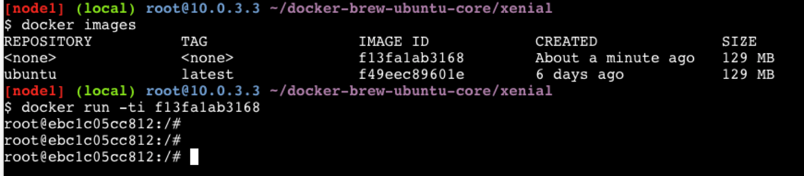
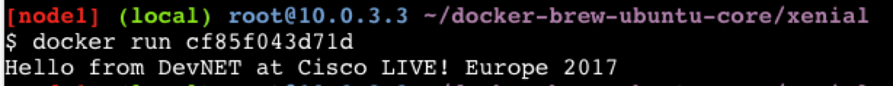
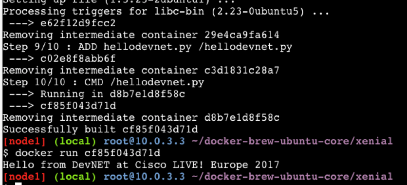

# Building a Docker Image

Next we'll build our own Ubuntu Docker image instead of using the one
from DockerHub.

1. Download the files  
Begin by downloading the Dockerfile and its dependencies.  
   ```
   git clone -b dist https://github.com/tianon/docker-brew-ubuntu-core.git
   ```

2. Check the Dockerfile  
Change directory to the cloned repository and ensure that the
Dockerfile is present.
   ```
   cd docker-brew-ubuntu-core/xenial
   ls .
   ```

3. Build a new image using Docker and the Dockerfile  
   ```
   docker build .
   ```  
Docker prints progress messages as it builds the Ubuntu image. Once it
finishes building the image, Docker assigns it a randomly-chosen name.  

4. Run the command `docker images`  
Docker lists all the images on your system, including both the
newly-built one and any that you previously downloaded. You can tell
which image is the one you just created by examining the list; it's
the only image that isn't associated with a repository:   


5. Run the new image
Run the newly created docker image by giving the randomly-chosen ID to
Docker:
   ```
   docker run -ti <your image ID>
   ```  
The newly-created image behaves exactly the same way as the Ubuntu
image from Dockerhub because was built from the same Dockerfile.


# Building the Custom Cisco Learning Labs Container

To modify the image that we just built all we have to do is change the
Dockerfile and ensure that any resources needed by the new Dockerfile
are available in the repository. Let's do that; let's make an image
that's more specific to our application's needs.

I'm currently sitting in at Cisco LIVE! Europe 2017 in the wonderful
city of Berlin, so let's change the image to say that when it runs!



To make the image display that message we will:

1. Create a new Python script

2. Edit the Dockerfile to include that script in the container build

3. Change the Dockerfile to install python in the container (remember,
all dependencies must be present in the container)

4. Build and test the new container

You have a choice young Jedi:

You can either

* Copy and paste following Dockerfile commands
* Type them into the file manually
* Download the Github repository that contains them

You can clone the Github repository that contains the Dockerfile for
this section using the following command:

```
git clone https://github.com/matjohn2/container-intro-devnet.git
cd container-intro-devnet
```

The cloned repository contains two files:

* hellodevnet.py
* Dockerfile

The "hellodevnet.py" file is our custom application. It contains the
following Python code:

``` python
#!/usr/bin/env python

print("Hello from DevNET at Cisco LIVE! Europe 2017!")
```

The Dockerfile contains the instructions to build the custom image:

```
FROM ubuntu
RUN apt-get update
RUN apt-get -y install python
ADD hellodevnet.py /hellodevnet.py
CMD ["/hellodevnet.py"]
```

The Dockerfile says:

1. `FROM ubuntu`  
   Extend the existing ubuntu public docker image. When you start from
   an existing image you don't have to rebuild it each time. Our
   previous images used the command `FROM scratch`, meaning that they
   didn't extened an existing image. Because they didn't build on an
   exiting image they had to rebuild the Ubuntu environment each time
   they built the image.

2. `RUN apt-get update`  
   Ensure the package-management tools in the base Ubuntu container
   are ready to run.

3. `RUN apt-get -y install python`  
   Use apt-get to install Python and all its dependencies in the
   container. The reason we built the imag on Ubuntu was so that we
   could use apt-get to install Python.

4. `ADD hellodevnet.py /hellodevnet.py`  
   Copy our Python program from the local directory into the container
   as `/hellodevnet.py`

5. `CMD ["/hellodevnet.py"]`  

   Run our Python program when the container starts up.

That's all there is to it. Let's actually build the new container image!

```
docker build .
```



Now you can run the new Container. WHen you do, you should see the
hello message displayed in the container terminal.

Congratulations, you've just built and run a custom docker image!

Now let's build a container image that does something more useful: how
about a container with a web server in it?
