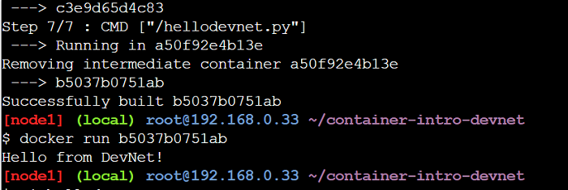

# Building a Docker Image

Next we'll build our own Ubuntu Docker image instead of using the one from Docker Hub.

1. Download the Ubuntu Dockerfile and its dependencies.  
   ```
   git clone --single-branch --branch dist-amd64 https://github.com/tianon/docker-brew-ubuntu-core.git
   ```

2. Change directory to the cloned repository and ensure that the Dockerfile is present.  
   ```
   cd docker-brew-ubuntu-core/xenial
   ls .
   ```  

3. Build a new image using Docker and the Dockerfile.  
   ```
   docker build .
   ```  

   Docker prints progress messages as it builds the Ubuntu image. Once it finishes building the image, Docker assigns it a randomly-chosen name.

4. Run the command `docker images`.
   Docker lists all the images on your system, including both the newly-built one and any that you previously downloaded. You can tell which image is the one you just created    by examining the list; it's the only image that isn't associated with a repository:
   
      

5. Run the newly created Docker image by giving the randomly-chosen ID to Docker:
   ```
   docker run -ti <your image ID>
   ```  
   The newly-created image behaves exactly the same way as the Ubuntu image from Docker Hub, because it is built from the same Dockerfile. You now have a bash root prompt.
   
6. Run the following command to confirm standard Ubuntu directories are installed:
    ```
    ls
    ```

# Building a Custom Cisco Learning Labs Container

To modify the image that we just built, all we have to do is change the Dockerfile and ensure that all required resources are available in the repository. Let's make an image that's more specific to our application's needs.

Let's change the image to display the following message:

 ```
 Hello from DevNet!
 ```

To make the image display the above message we will:

1. Create a new Python script.  

2. Edit the Dockerfile to include that script in the container build.  

3. Change the Dockerfile to install Python in the container (remember, all dependencies must be present in the container).  

4. Build and test the new container.  


To update the image, follow the below instructions:

1. Clone the Github repository that contains the Dockerfile for this section using the following command:

     ```
    git clone https://github.com/CiscoDevNet/container-intro-devnet.git
    cd container-intro-devnet
    ```

   The cloned repository contains these files:

   * hellodevnet.py
   * Dockerfile

   The "hellodevnet.py" file is our custom application. It contains the following Python code:

     ``` python
      #!/usr/bin/env python
      print("Hello from DevNet!")
     ```

   The Dockerfile contains the instructions required to build the custom image:

    ```
    FROM ubuntu
    RUN apt-get update
    RUN apt-get -y install python
    COPY hellodevnet.py /hellodevnet.py
    RUN ["chmod", "+x", "/hellodevnet.py"]
    CMD ["/hellodevnet.py"]
    ```

   This Dockerfile says:

   1. `FROM ubuntu`  
       Extend the existing ubuntu public Docker image. Our previous examples built an image from scratch. In this case we begin with a previously-built container image and           extend with our own customisations.

   2. `RUN apt-get update`  
       Ensure the package-management tools in the base Ubuntu container are updated to use the latest software.

   3. `RUN apt-get -y install python`  
       Use apt-get to install Python and all its dependencies in the container. The reason to build this container on an existing Ubuntu image is that we could use apt-get to install needed software.

   4. `COPY hellodevnet.py /hellodevnet.py`
       Copy the Python program from the local directory into the container as `/hellodevnet.py`.
        
   5. `RUN ["chmod", "+x", "/hellodevnet.py"]`
       Grant permission to execute the `/hellodevnet.py` file
      
   6. `CMD ["/hellodevnet.py"]`  
    Run the Python program when the container starts up.
    
    >**Note:** Instead of cloning this GitHub repository, you can also add the above mentioned Python code in the hellodevnet.py file and Dockerfile commands in the Dockerfile using the `vi` command in the terminal and continue with step 2.
   
2. Build the Docker image using the following command:

    ```
    docker build .
    ```
    Docker prints progress messages as it builds the Ubuntu image. Once it finishes building the image, Docker displays `Succesfully built <CONTAINER ID> ` message.
    Make note of the newly built `<CONTAINER ID>` so that you can use it in the next step.
    
3. Run the new container using the following command.
   Use the `<CONTAINER ID>` that you recieved from the `docker build .` command output.

    ```
    docker run <CONTAINER ID>
    ```
    The "Hello from DevNet!" message is displayed in the container terminal.
    
    

Congratulations, you've just built and run a custom Docker image!

Now let's build a container image that does something more useful: how about a container that runs a web server?
