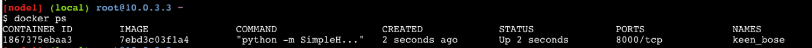
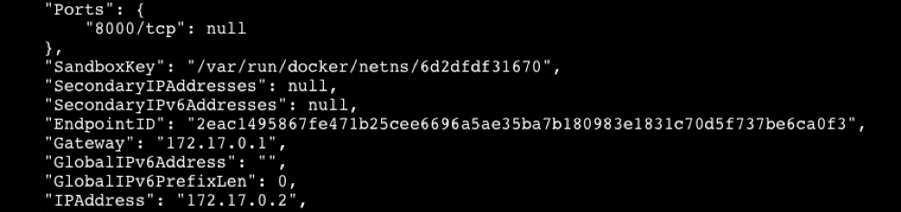
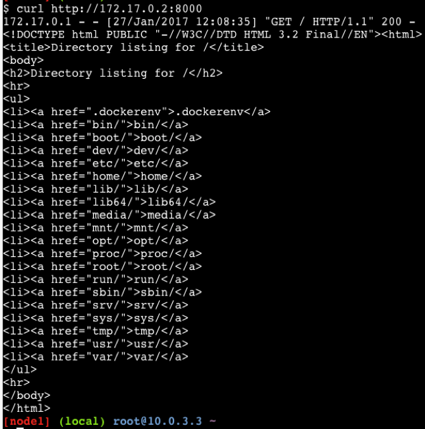

# Building w web server container

A Docker container image can run any application you like. Let's build
one that runs a web server. The web server will run whenever the
container image starts up.

The following python command creates and starts a simple web server:

```
python -m SimpleHTTPServer 8000
```

To build a container that runs this web server we need only change the
`CMD` line of the Dockerfile&mdash;the line that controls the program
that runs when the container starts.

The new Dockerfile looks like this:

```
FROM ubuntu
RUN apt-get update
RUN apt-get -y install python
EXPOSE 8000
ENTRYPOINT ["python", "-m", "SimpleHTTPServer", "8000"]
```

The first three lines are familiar. The last two introduce new
Dockerfile options.

* EXPOSE 8000  
  The EXPOSE command allows us as developers to "build in" documentation of
  what ports our application uses. Running this container in future with `-P`
  will automatically map any `EXPOSE` ports in the Dßockerfile to a dynamic port
  on our hosts real IP, allowing real remote connections to our service if necessary.
  You can see what port has been mapped by using the `docker ps` command as below:

  ```
  docker run -P 86edbfe17927 &
  [1] 18291

  docker ps
  CONTAINER ID        IMAGE                                                      COMMAND                  CREATED             STATUS              PORTS                     NAMES
  7edf98bc653b        86edbfe17927                                               "/app/myApp.py"          3 seconds ago       Up 2 seconds        0.0.0.0:32768->5000/tcp   jolly_mestorf

  curl localhost:32768
  172.17.0.1 - - [18/Jan/2019 12:40:17] "GET / HTTP/1.1" 200 -
  Hello Cisco
  ```

* ENTRYPOINT [“python”, “-m”, “SimpleHTTPServer”, “8000”]  
  Like CMD, the ENTRYPOINT command runs a program, but it also does
  something else: it enables us to pass arguments to the program. We
  use this feature to pass arguments to Python to start the web server.

Save the Dockerfile in a new directory and build the new web server
container image:

```
docker build .
docker run -P <your new container id> &
```

Why don't we see any output?

Every time before when we started a container we saw output from the
container's application. The reason we see no output this time is that
our application, a web server, doesn't print any. So how do we know
whether it's running correctly?

Run the following Docker command:

```
docker ps
```

The command lists all running containers&mdash;including the new
web server image that we created:



The web server is running. Now how do we connect to it?

By default Docker gives each container an internal IP address on the
host. We can find out our container's IP address by running `docker
inspect <container ID>`. Running this command displays a great deal of
information about the container. Included in the output is the
container's address, identified as "IPAddress":



Now that we know the IP address and port on which the web server can be
reached, we can make a connection.

```
curl http://<container IP>:8000
```

The built-in Python web server by default serves the contents of its
working directory. Because our Dockerfile copied the Python script to
the root of the container, that's the directory that the web server
displays:



Success! We can see the web server running in the container that we
created, and when we connect to the web server it shows a list of the
files in the container's root directory.

## Extra credit

You now know how to `ADD` files to the Docker build process. If you
create a file named "index.html", add some HTML text to it, then use
the Dockerfile to add it to the root of the container, guess what the
new web server container will serve instead of the directory listing?

Give it a try!

# Summary

In this learning lab we have:

* Understood how Docker images are built using Dockerfiles

* Understood how publicly-available Docker images are built by viewing
  their Dockerfiles

* Built and ran our own Docker images

* Connected to a web server running in a custom Docker container that
  we built

Give yourself a pat on the back, grab a coffee and enjoy the related
Labs.

That's all folks!
