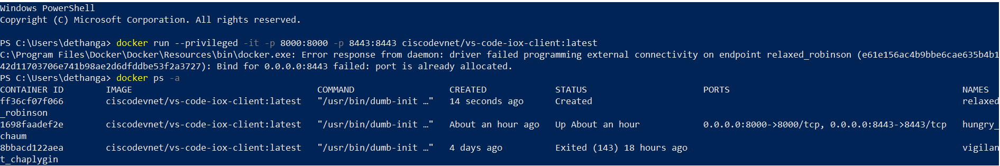
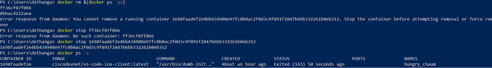
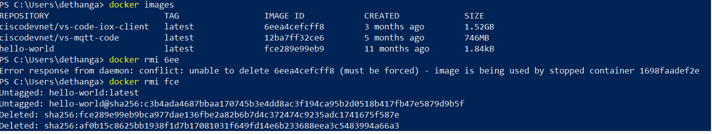

# How to remove an existing Docker Container and Images

In this section, you will learn how to remove/delete old instances of Docker container and its images. Also, you can learn and practice additional Docker commands.

1. In the Windows PowerShell mode, run the following command to get the list of containers:
   
   `docker ps -a`
   
     
    
2. If you want to remove the old instances of the container, execute the following command:
   
   **Note**: Docker will not allow to remove the running container directly, hence you need to apply `docker stop`
    command to stop the process.   
    
    `docker rm $(docker ps -qa)`
   
     
   
3. To get the list of existing docker images, execute the following command:
   
   `docker images`
   
4. If you want to remove the docker image, execute the following command:
    **Note:** You can add the first three characters of the "IMAGE ID", so that the docker will automatically pick the right one!.
   
   `docker rmi <image id>`
   
     

## Summary of Docker Commands

Here is the list of frequently used Docker commands for your reference.

|Commands|Usage|
|--------|-----------|
|docker –version|This command is used to get the currently installed version of docker.|
|docker pull <image name>|This command is used to pull images from the docker repository(hub.docker.com).|
|docker run -it -d <image name>|This command is used to create a container from an image.|
|docker ps|This command is used to list the running containers.|
|docker ps -a|This command is used to show all the running and exited containers.| 
|docker exec -it <container id> bash|This command is used to access the running container.|
|docker stop <container id>|This command stops a running container.|
|docker commit <conatainer id> <username/imagename>|This command creates a new image of an edited container on the local system.|
|docker push <username/image name>|This command is used to push an image to the docker hub repository.|
|docker images|This command lists all the locally stored docker images.|
|docker rm <container id>|This command is used to delete a stopped container.|
|docker rmi <image-id>|This command is used to delete an image from local storage.|
|docker build <path to docker file>|This command is used to build an image from a specified docker file.|
