# Docker Swarm

Docker provides its own orchestration solution for containers, called [Docker Swarm](https://docs.docker.com/engine/swarm/) (although there are other options, like [Kubernetes](https://kubernetes.io) that was open-sourced by Google). When moving containers to production you need an orchestration solution that aggregates the resources of a number of underlying hosts and offers them to containers users. This solution is also responsible for making sure the right number of containers are healthy for every defined service, starting new ones when it is required according to the policies defined by each user.

Its architecture includes 2 types of nodes: *managers* and *workers*, usually implemented in different hosts. *Managers* provide the control function for the whole architecture, and *workers* actually run the containers that provide service to end users.

It is very easy to create a Swarm testbed for our learning. Use your browser to go to [play-with-docker](http://play-with-docker.com), click 'Login', and then 'Start'. In the main page please click on this icon you will find on the left part of the screen:


You will be offered with some different templates, please click on the '3 managers and 2 workers' one. That will generate 5 different hosts for you, with one CLI window for each one.

From any of the 3 manager nodes you may check the complete list of nodes and their status with `docker node ls`.

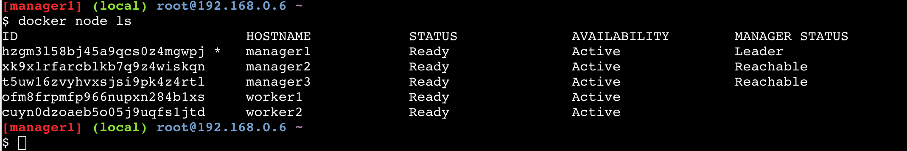

It is THAT easy and now you already have your swarm working and ready to rock!

### Your first Stack

A *stack* is a collection of services that are related and usually work together for an application.

Let's create our first stack in the simplest way: with just one service. For this single service (*web*) we will specify the requirement to deploy 3 copies of the same container, what are the hardware requirements, ports mapping (port 80 in your local host to port 8000 in your container) and network to use. Please be aware that networks are load-balanced by default to all containers in the service it provides connectivity to.

In one of the manager nodes create the required YAML file in a local directory, with `vi docker-compose.yml` and the following content:

```
version: "3"
services:
  web:
    image: <your_docker_id>/<your_app_name>
    deploy:
      replicas: 3
      resources:
        limits:
          cpus: "0.1"
          memory: 50M
      restart_policy:
        condition: on-failure
    ports:
      - "80:8000"
    networks:
      - webnet
networks:
  webnet:
```

Now you can deploy your stack in the swarm:

```
docker stack deploy -c docker-compose.yml mylab
```

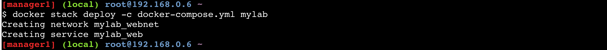

Check your new service ID, number of replicas, image name and exposed ports:

```
docker service ls
```

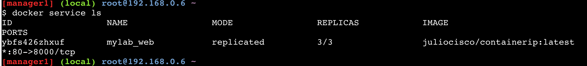

List the containers (aka 'tasks') for your service and how they are distributed across the VMs:

```
docker service ps <your service name>
```

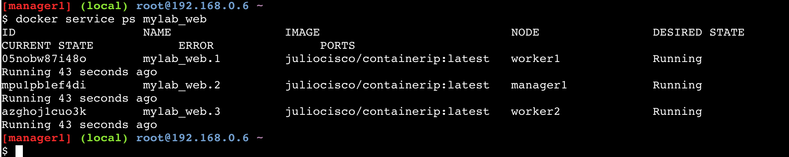

You can now access the service via the IP of any node (worker or manager) several times, so that you check how IP changes when different containers in the swarm serve different requests.

In order to find out what IP address you should curl from each node, please run `ifconfig eth0` in one node (ie. manager2) and note the IP address next to `inet addr:`.

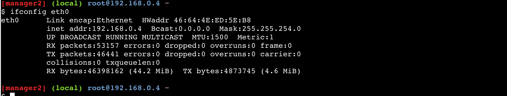

Then go to another node (ie. worker1) and run `curl <IP manager2>/cgi-bin/ip` several times, so you see the IP address change when different containers serve the request.

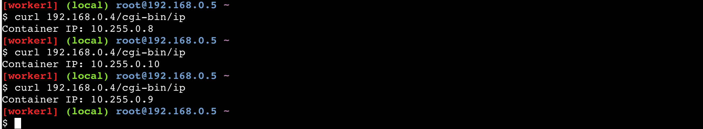

You may also `curl` your own IP address from each node, with identical results.

```
curl localhost/cgi-bin/ip
```

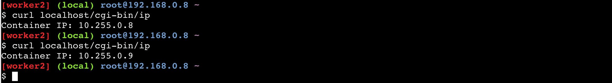

The reason why all these options work is that the network you created is shared and load-balanced by default. All swarm nodes participate in an ingress routing mesh, and reserve the same service port in all nodes.

Now let's edit the YAML file and change the number of replicas to 5, with `vi docker-compose.yml`, and redeploy:

```
docker stack deploy -c docker-compose.yml mylab
```

Verify you now have 5 containers/tasks running for your service:

```
docker service ps <your service name>
```

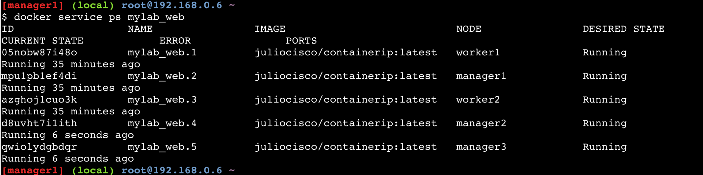

From any manager node you may now take the stack down:

```
docker stack rm mylab
```

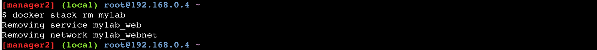


### Overlay networking

As you may remember we have already discussed single-host networking in past chapters. Now is the time to investigate multi-host networking with overlay *networks*.

From *manager1* let's create a new overlay network called *overnet* by specifying the driver (`-d`) to use as *overlay*:

```
docker network create -d overlay overnet
docker network ls
```

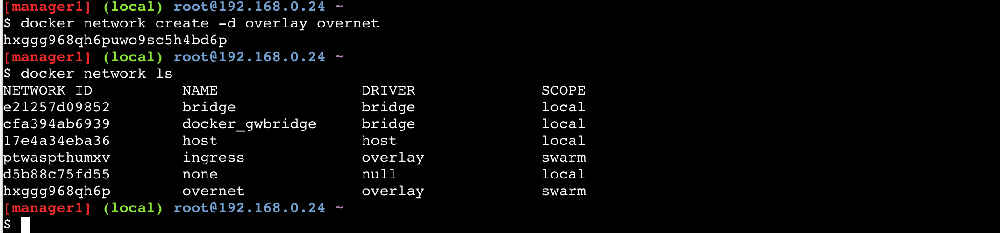

If you run `docker network ls` from any other manager node you will see the same networks, including the new *overnet*. However if you run the command from any of your worker nodes, you will not see *overnet*. The reason is there are no service containers running in this new network yet.

Let's now create a new service from one of the manager nodes:

```
docker service create --name myservice --network overnet --replicas 5 ubuntu sleep infinity
```

Check until the service and the 5 replicas are up with `docker service ls`.

Now verify that there is one replica running in each of your Swarm nodes:

```
docker service ps myservice
```

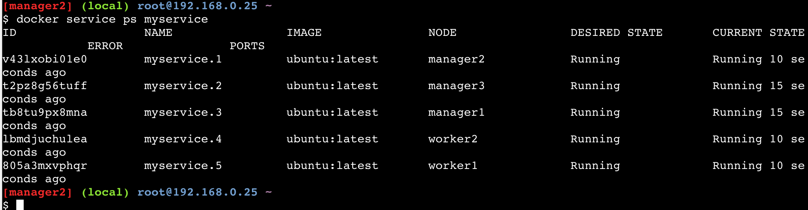

If you check the networks again in your worker nodes with `docker network ls`, *overnet* will be there. The reason is that now one of the container using *overnet* resides in your worker node.


Please use `docker network inspect overnet` in one of your worker nodes (ie. worker2), and write down the IP address of the container running in that worker node.


Now go to your worker1 node and list your running containers with `docker ps` (you should see only one), copy its ID and connect to it. Then install *ping* utility, and ping the IP address of the container running in worker2 (the one you noted in the previous step).

```
docker attach -it <container ID> /bin/bash
  apt-get update && apt-get install -y iputils-ping
  ping -c5 <worker2_container IP>
```

Congrats!! You have just verified the connectivity between containers in different hosts, via an overlay network.

Let's now learn about Service Discovery.

From inside the container where we were in last step, please run `cat /etc/resolv.conf` and look for the *nameserver* entry. That IP address belongs to a DNS resolver embedded in all Docker containers (ie. 127.0.0.11:53).

You may go ahead and ping 'myservice' from inside the container, with `ping -c2 myservice`. Please note down the IP address answering your ping requests.

Now go to a manager node, and from that host run `docker service inspect myservice`. Towards the bottom of the output you will find the IP address of that service Virtual IP. You will see it is the same as the IP answering your ping requests in the previous step.

Let's clean up by removing the service from one of the manager nodes, with `docker service rm myservice`.

## Success!

You have now learned how to deploy your service containers into Docker's native orchestration solution, Swarm. You have also explored how inter-host network connectivity works. You have gone a long way!


## Summary

In this learning lab we have:

* Learned basic management of containers along its lifecycle
* Built your own Docker images manually or using Dockerfiles, and learned how to publish them
* Understood how networking works for containers with pros/cons for different options
* Discovered how containers storage can be persistent and shared
* Learned how to automate the creation of containers belonging to the same services
* Used Docker's native orchestration solution to deploy containers in production

Give yourself a pat on the back, grab a coffee, and enjoy the suggested related Labs.

That's all folks!
